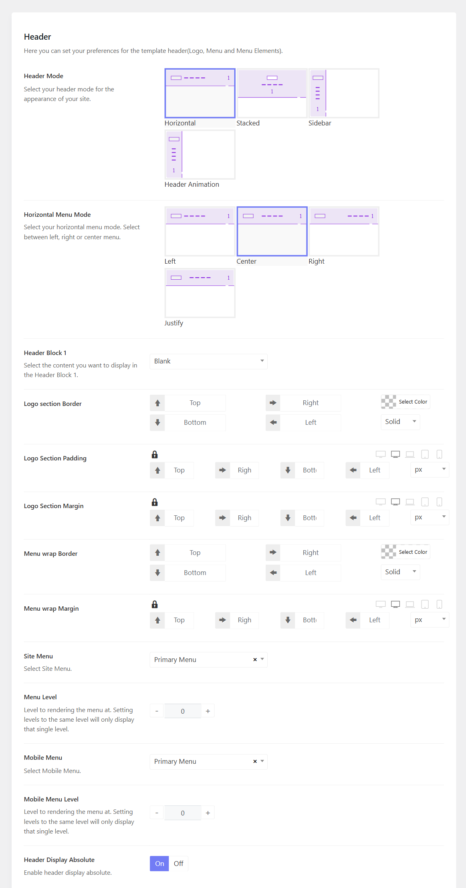

# Theme's Header

You can go to Sports Options > Headers > There you can see 6 prebuilt header templates > You can edit one by one.

Open each header template, you will see options to configure the header logo, header layout and others.

## Header modes

There are many header modes for you to choose from, including Horizontal, Stacked, and Sidebar.

## Header Block 1

Block 1 is a position where you can place a widget, contact info, and a custom html, It can be on the right of a horizontal menu, below the stacked menu, and at the bottom of the sidebar menu.

## Transparent Header

You can see the transparent header on the home page 1, home page 2, and home page 3. To enable or disable the transparent header, you can enable the option "Header Display Absolute"

