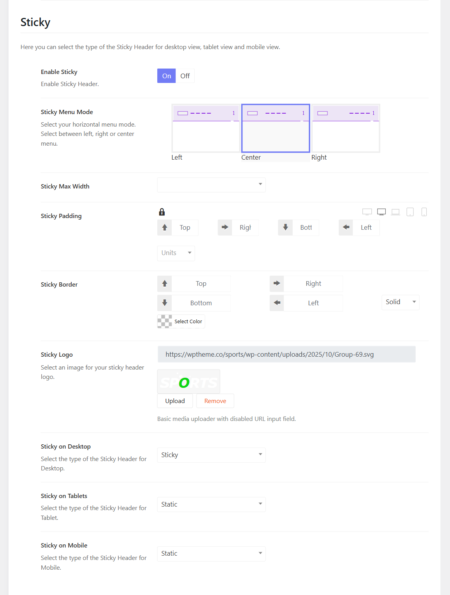

# Sticky Logo

Below the Logo section, you'll see the sticky options. Here you can enable or disable the sticky menu option.

* Sticky Menu Mode: there are 3 main sticky menu modes including Left, Center and Right.
* Sticky Max-width: you can choose an option for the sticky width. 
