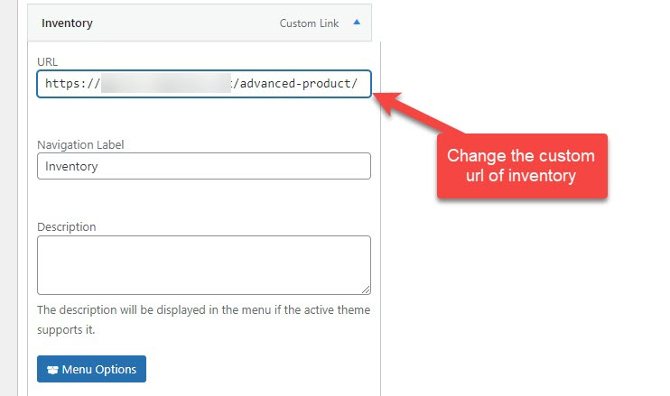

# Change Inventory Permalink

## Change Inventory Permalink

To change the permalink of the Inventory page, you can go to Wp-admin > Settings > Permarlinks > Optional > Edit Advanced Product archive slug.

Change the Advanced Product's slug

Then go to Appearance > Menus > Edit the main menu > Toggle Inventory menu item > Change the custom link according to the newly changed slug above. 

Ex: If Advanced Product archive slug is: advanced-product
So the inventory url should be: http://www.yourdomain.com/advanced-product

