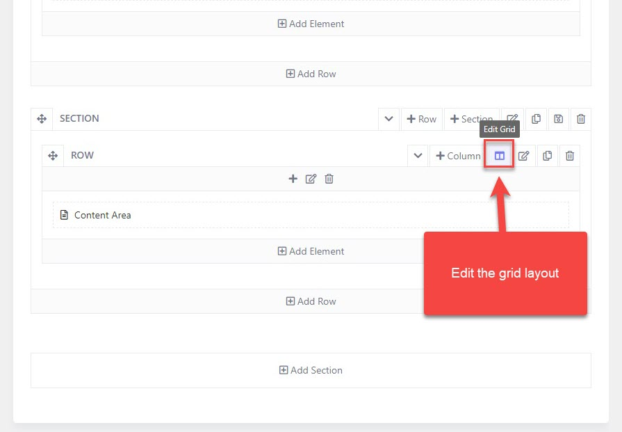
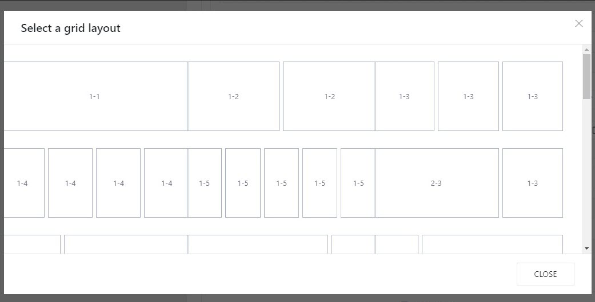
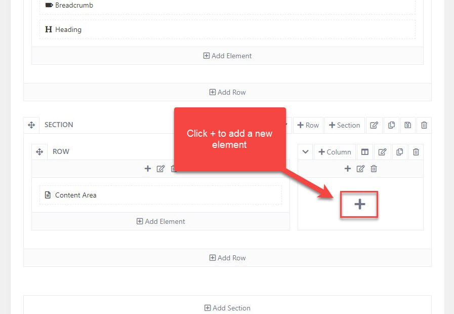
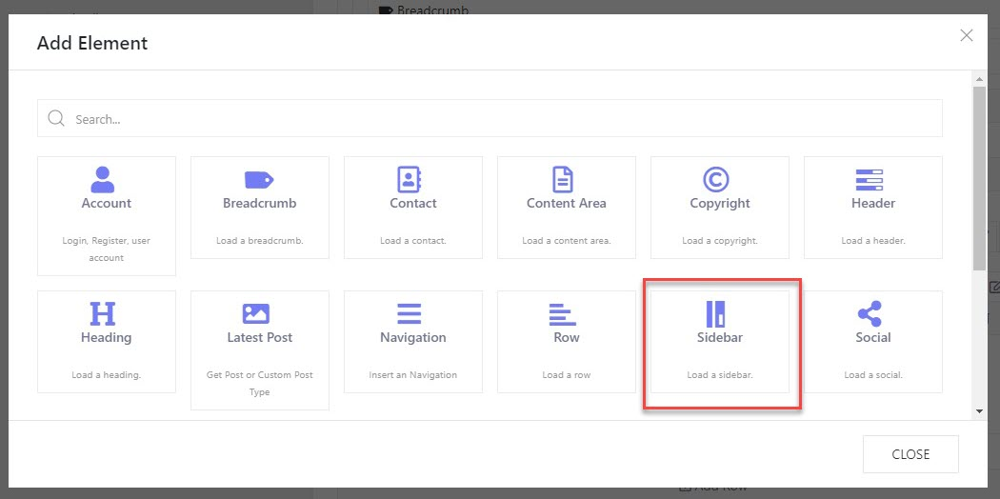

# Add a new sidebar

To create a new sidebar, you should go to Theme Options > Templates > Open your template (ex: Shop layout template) > Layout.

* In the content area section, edit the grid layout
* Choose one of the available grid layouts or you can customize a layout according to your need.

Click + to add a new element to the column, then a popup appears and shows you an element panel.

Select the Sidebar element to add it to the column.

After adding the sidebar element, you can start editing the sidebar and assign a widget to it. 

