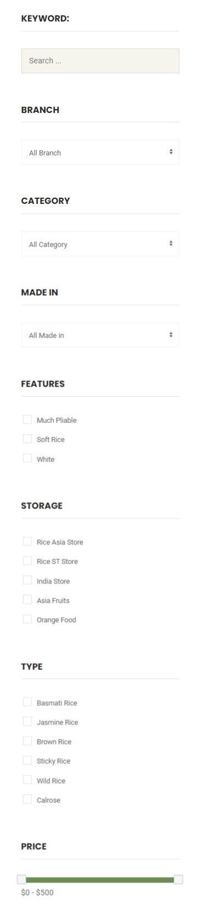
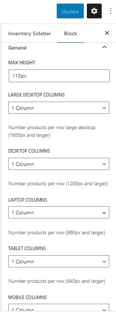

# Inventory Sidebar

You can find the inventory sidebar on the Inventory page. This sidebar was created with TemPlaza - Advanced Products Filter which allows you to add different advanced products filters according to custom fields (ex: Branch, Make, Model, Manufacturer, Price, Year and so on) 

* Select custom fields:  add custom fields to the sidebar.
* Filter by keyword: enable it if you're interested in showing a field to search products by keyword.
* Limit Height Fields: Enable it to limit the height of fields.
* Submit Text: you can edit the Search button's text here.
* Use ajax for filtering: Enable the option to activate ajax filtering which will hide the search call-to-action button
* Update URL: Update the url when filtering custom fields.
* Filtering products instantly (no buttons required):

## General Options

* Max height: the height of the filter if it's not expanded (See less).
* Below max height are options to configure the number of columns (number of products per row) on different devices: large desktops, desktops, laptops, tablets, and mobile phones.