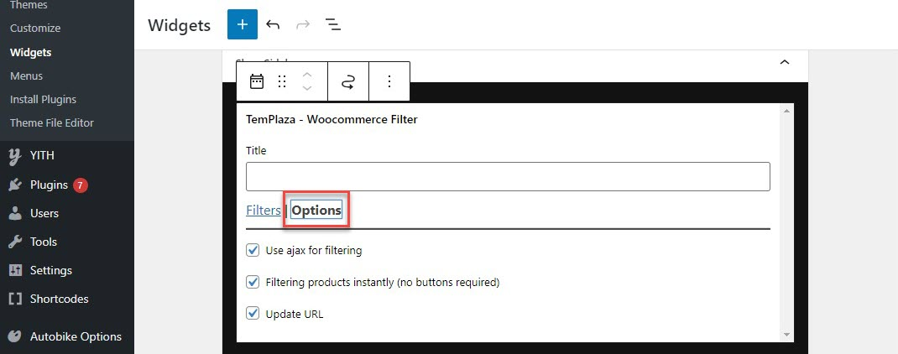

# Sidebars & Widgets

There are different pre-defined widgets that you can find in the Appearance > Widgets.

## Main Sidebar:

Please go to Appearance > Widgets > Toggle the main sidebar and edit the sidebar's content. 

The main sidebar is usually located on the blog pages which are assigned to the default layout.
You can go to Agruco Options > Settings > Layout > Edit the sidebar > Choose a sidebar widget. 

## Shop Sidebar

The shop sidebar is located on the shop page. It's built with TemPlaza - Woocommerce Filter which allows you to add various filters to the sidebar such as Category, Brand, Group, Rating, Price, and Tags. 

Click on "Add A New Filter" to add more filters to the sidebar.

Click on the Options tab > you'll see options:

* Use ajax for filtering
* Filtering products instantly (no buttons required)
* Update URL

