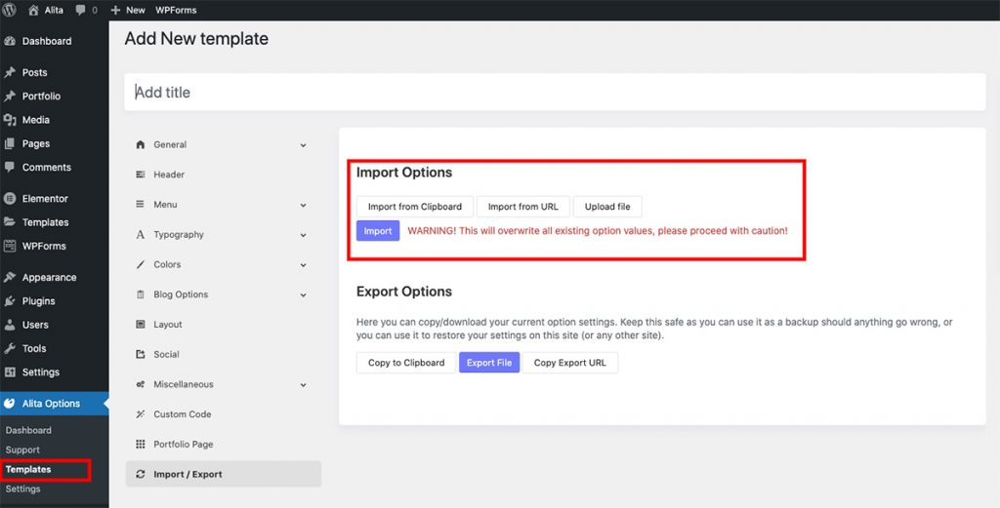
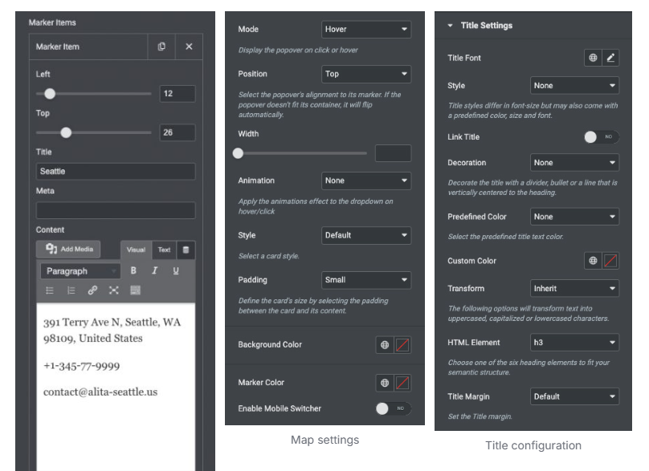
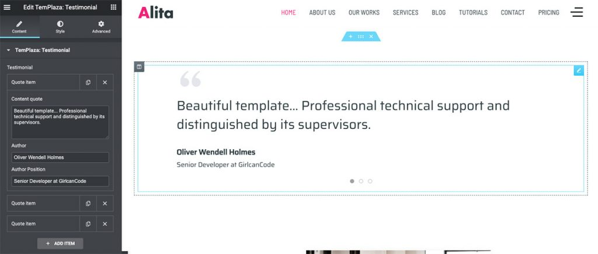

# Alita – About

To set up About Page You have to install the required plugins including Elementor Website Builder and TemPlaza Elements.


The Home Page uses different Elementor widgets.

## View About Page layout view on frontend:


## Steps to Create the About demo menu items

The About page on the demo site uses TemPlaza: Heading, UI Text, UI Accordion, UI Card, Testimonials, UI Image, UI Marker & UI Icon widgets to display the Content.

Here is a guide to creating About Page:

### Step 1: Create a template site

* Go to unzipped folder -> data-import -> templates -> home_page.json
* Go to wp-admin -> Alita Options -> Templates -> Click “Add New” -> Import / Export
* Insert Template title -> Click Publish


Choose import file to import file



Click “Upload file” >> Choose import template file from download package >> Click “Import” >> Add Title “Elementor Template” and click to Publish

### Step 2: Create a new page

Go to wp-admin -> Pages -> Add New Page -> Edit with Elementor -> Publish


### Step 3: Configure Elementor widgets

About Page uses TemPlaza: Heading, UI Text, UI Accordion, UI Card, Testimonials, UI Image, UI Marker & UI Icon widgets.

#### 1.Heading section

Heading section uses TemPlaza: UI Text


Add title and content. Configure heading style “Medium” and title tag “h1”.

#### 2.Image Heading

Add a section with 2 columns -> Drag ‘n drop TemPlaza UI Image Widget.


Select Image and configure Image Size

#### 3.About Company

About Company section uses TemPlaza: UI Text, UI Accordion

**3.1. 10 Years’ Experience In It**

Use UI Text to setup Title and Content. To setup likes demo please use code below:

```
<div class="uk-flex-inline uk-flex-bottom"><span class="uk-text-bold uk-margin-small-right" style="font-size: 180px; color: rgb(235, 43, 122); line-height: 0.82;">10</span> Years’ experience in IT</div>
```
Use UI Text to display content Use style Lead to display content.


Enter your title, sub title and content.

**3.2.UI Accordion**

Use UI Accordion to setup FAQs.


Enter your title and content for each accordion item.

#### 4.Marker Section

Marker section uses TemPlaza: UI Marker


Add maker items and configure them



#### 5.Core Value Section

The core Value section uses TemPlaza: UI Card


Enter your title, content.

#### 6.Testimonials



Add quote text, author and position.

#### 7.Core Team Section

Core Team section uses UI Text for title and UI Person for your team.


#### 8.Call to action section

Call to Action section uses TemPlaza Heading and UI Icon.

**8.1. TemPlaza: Heading**


Add call to action text and add link

**8.2 TemPlaza: UI Icon**


Configure Icon and Link


