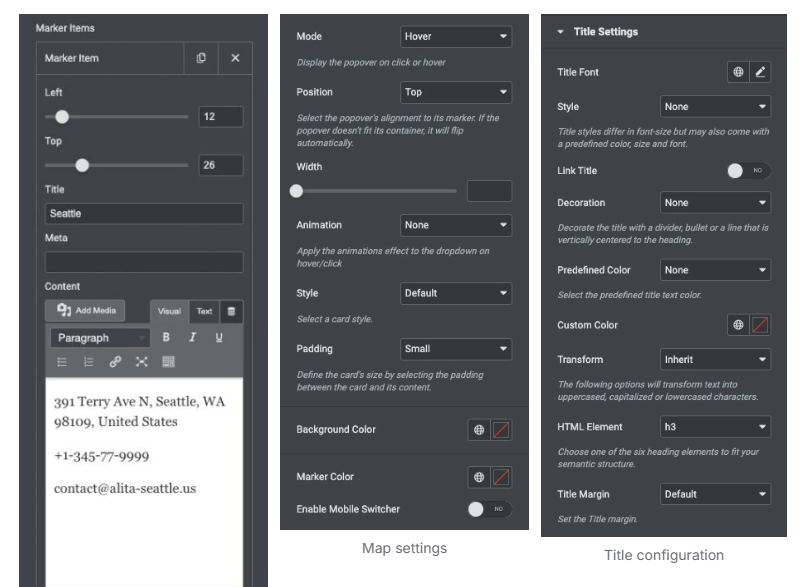

# Alita – Contact

To setup Contact Page You have to install require plugins included: Elementor Website Builder, Contact Form by WPForms and TemPlaza Elements.

The Contact Page uses different Elementor widgets.

## View Contact Page layout view on frontend:

## Steps to Create the Contact Demo Menu Items

The Contact page on the demo site uses TemPlaza: Heading, UI Text, UI Accordion, UI Card, UI Marker, and WP Form widgets to display the Content.

Here is a guide to creating Contact Page:

## Step 1: Create a template site

* Go to unzipped folder -> data-import -> templates -> elementor_template.json
* Go to wp-admin -> Alita Options -> Templates -> Click “Add New” -> Import / Export
* Insert Template title -> Click Publish

## Step 2: Create a new page

Go to wp-admin -> Pages -> Add New Page -> Edit with Elementor -> Publish

## Step 3: Configure Elementor widgets

Contact Page uses TemPlaza: Heading, UI Text, UI Accordion, UI Card, UI Marker, WP Form widgets.

### 1.Heading section

The heading section uses TemPlaza: UI Text

Add title and content. Configure heading style “Large” and title tag “h1”.

### 2.Contact Form Section

Add section with 2 columns. Contact Form section uses TemPlaza: Heading, UI Text, UI Accordion and WPForm

#### 2.1. TemPlaza: Heading

Enter title and highlight title. Configure Heading Style

#### 2.2. TemPlaza UI Text

Use UI Text widget to add text content.

#### 2.3. TemPlaza: UI Accordion

#### 2.4. TemPlaza: WPForms

### 3.Marker Section

Marker section uses TemPlaza: UI Marker

### 4.Contact Information Section

The contact information section uses TemPlaza: UI Card

