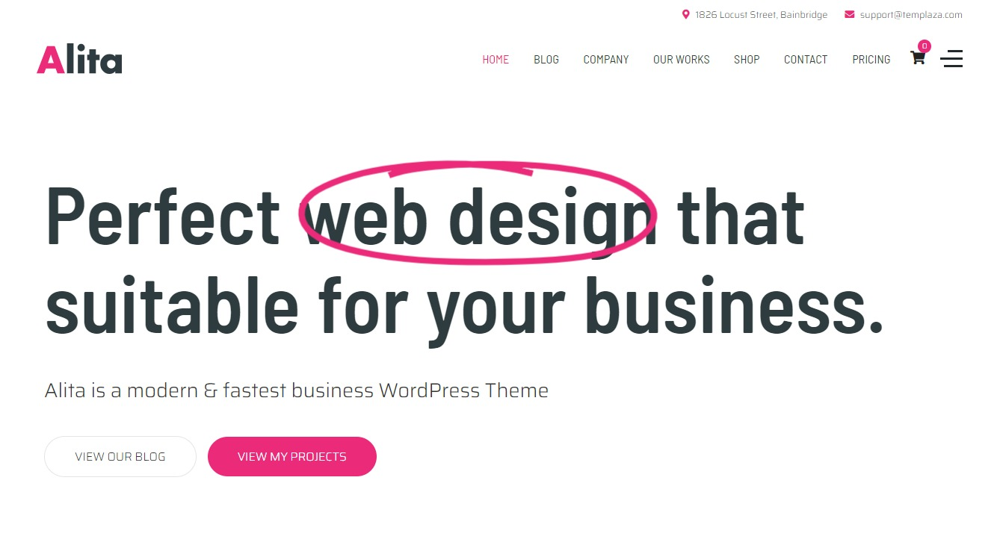
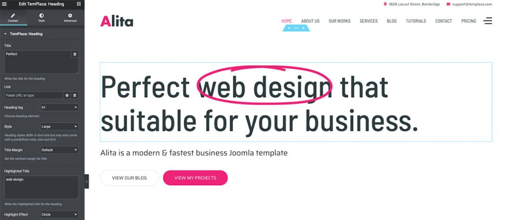
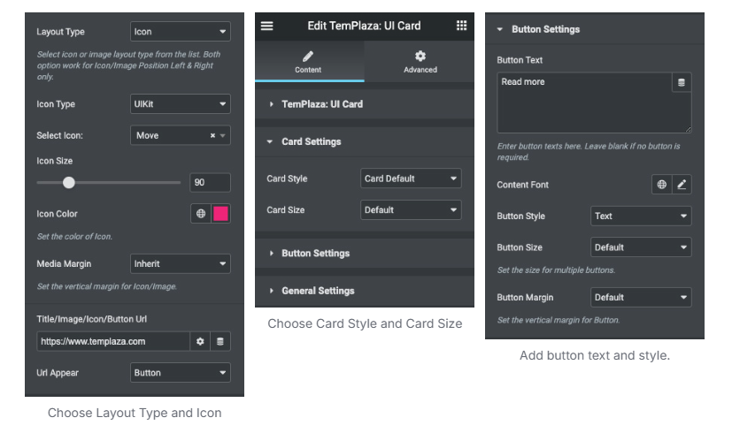
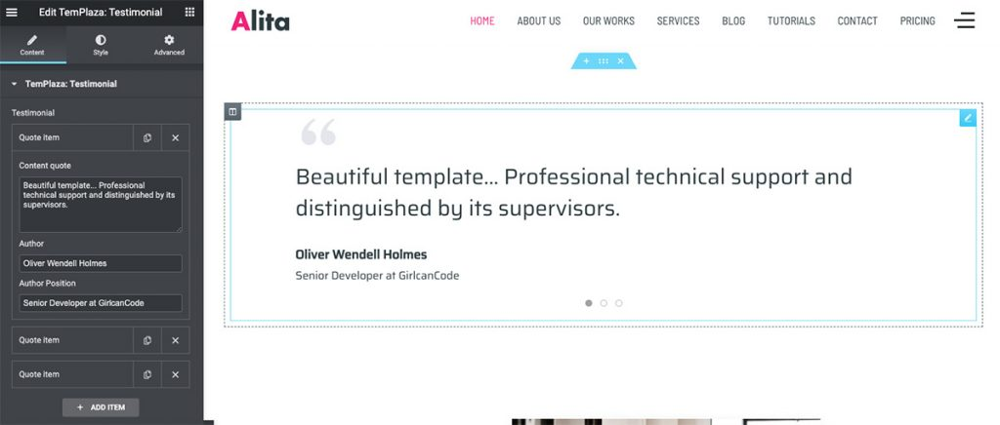
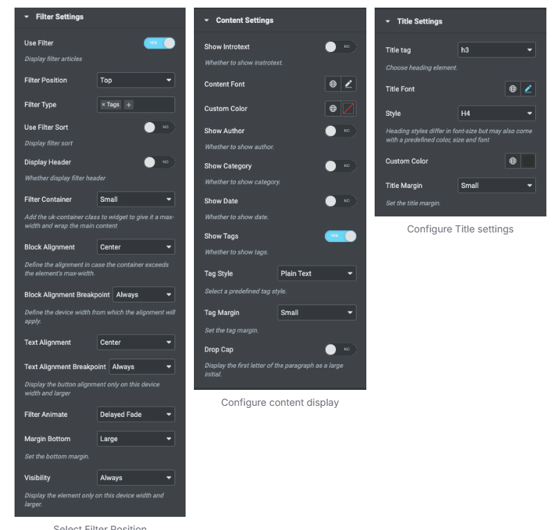
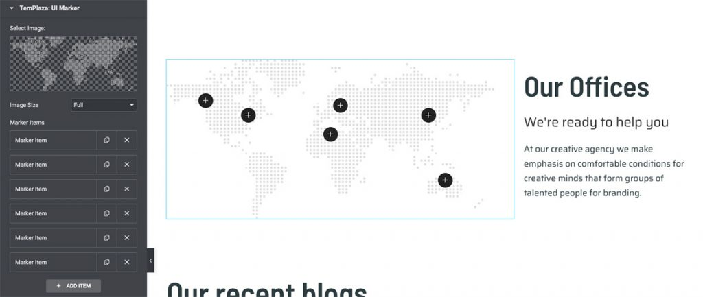

# Alita – Home Page

To setup Home Page You have to install require plugins included: Elementor Website Builder and TemPlaza Elements.

The Home Page uses different Elementor widgets.

## View the homepage layout view on frontend:

## Steps to Create the Home demo menu items

The Main Home page on the demo site uses TemPlaza: Heading, UI Text, UI Button, UI Card, Testimonials, UI Image, UI Post, UI Marker & Counter widgets to display the Content.

Here is a guide to create Home Page:

## Step 1: Create a template site

* Go to unzipped folder -> data-import -> templates -> home_page.json
* Go to wp-admin -> Alita Options -> Templates -> Click “Add New” -> Import / Export
* Insert Template title -> Click Publish

Choose import file to import file

## Step 2: Create a new page

Go to wp-admin -> Pages -> Add New Page -> Edit with Elementor -> Publish

## Step 3: Configure Elementor widgets

Home Page uses TemPlaza: Heading, UI Text, UI Button, UI Card, Testimonials, UI Image, UI Post, UI Marker & Counter widgets.

### 1.Heading section

Heading section uses TemPlaza: Heading, Text and UI Button

**1.1. TemPlaza: Heading Widget**

Add title, highlight and after highlight text. Configure heading style and highlight effect.

**1.2. Text Widget**

Add text widget with class=”uk-text-lead”

**1.3. TemPlaza: UI Button**

Enter your text and link -> configure button style and shape

## 2.Feature Box

Add a section with 3 columns -> Drag ‘n drop TemPlaza UI Card Widget.

**Extra settings**

## 3.Testimonials

## 4.About Company

About Company section uses TemPlaza: UI Text, UI Image and UI Button

**4.1. TemPlaza: UI Text**

Enter your title, sub title and content.

**4.2. TemPlaza: UI Button**

Enter your button text, link, icon and color.

**4.3. TemPlaza: UI Image**

Select your image. Configure image size and animation.

## 5.Counter Section

Add a section with 4 columns -> Drag ‘n drop Counter Widget.

Enter starting number and ending number.

## 6.Portfolio Section

Portfolio section uses TemPlaza: UI Text and UI Post

Choose Resource: Portfolio. Select a category or leave it blank. Configure limit and Responsive columns

**Extra settings**

## 7.Marker Section

The marker section uses TemPlaza: UI Text and UI Marker

Add maker items and configure them

## 8.Blog Section

Blog section uses TemPlaza: UI Text and UI Post

Choose Resource is Post, Select your category, Limit and Responsive Columns

