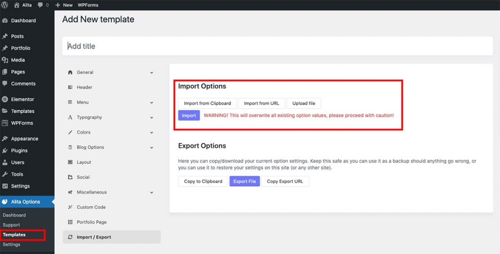

# Alita – Services

a To setup Service Page You have to install require plugins included: Elementor Website Builder and TemPlaza Elements.


The Services Page uses different Elementor widgets.

## Steps to Create the Service Demo Menu Items

The Service page on the demo site uses TemPlaza: Heading, UI Text, UI Card, Testimonials, UI Image, UI Marker & UI Icon widgets to display the Content.

Here is a guide to create Service Page:

## Step 1: Create a template site

* Go to unzipped folder -> data-import -> templates -> elementor_template.json
* Go to wp-admin -> Alita Options -> Templates -> Click “Add New” -> Import / Export
* Insert Template title -> Click Publish




## Step 2: Create a new page

Go to wp-admin -> Pages -> Add New Page -> Edit with Elementor -> Publish


## Step 3: Configure Elementor widgets

Service Page uses TemPlaza: Heading, UI Text, UI Accordion, UI Card, Testimonials, UI Image, UI Marker & UI Icon widgets.

### 1.Heading section

The heading section uses TemPlaza: UI Text

### 2.About Company

About Company section uses TemPlaza: UI Text, UI Accordion

#### 2.1. 10 Years’ Experience In It

Use UI Text to setup Title and Content. To set up likes demo please use code below:

```
<div class="uk-flex-inline uk-flex-bottom"><span class="uk-text-bold uk-margin-small-right" style="font-size: 180px; color: rgb(235, 43, 122); line-height: 0.82;">10</span> Years’ experience in IT</div>
```

Use UI Text to display content use style Lead to display content.

#### 2.2. World Map with UI Marker

Use UI Marker to setup Map and marker.


### 3.Feature Box Section

Feature Box section uses TemPlaza: UI Card. Add section with 3 columns -> Drag ‘n drop TemPlaza UI Card Widget.

### 4.Testimonials


### 5.Image Section

Image section uses UI Image.

### 6.Our Services

Our Services uses UI Text and UI Card for info box. Add section with 2 columns -> Drag ‘n drop TemPlaza UI Card Widget.

### 7.Call to action section

Call to Action section uses TemPlaza Heading and UI Icon.

#### 7.1. TemPlaza: Heading

#### 7.2 TemPlaza: UI Icon


