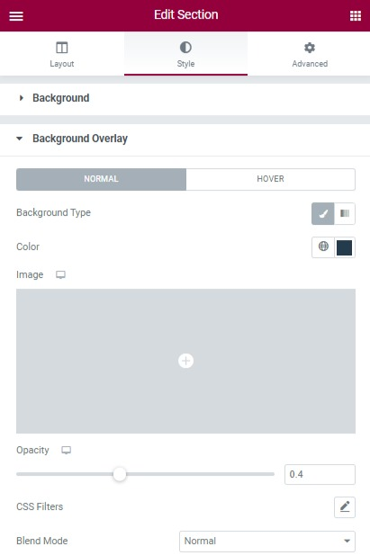

# Background Image

## How to change the background image

You should edit the page with Elementor > edit the section > edit the column > Style > Background > change the background image.

## How to change the background overlay

After changing the background image, you can move to the background overlay right below to change the background overlay. 

