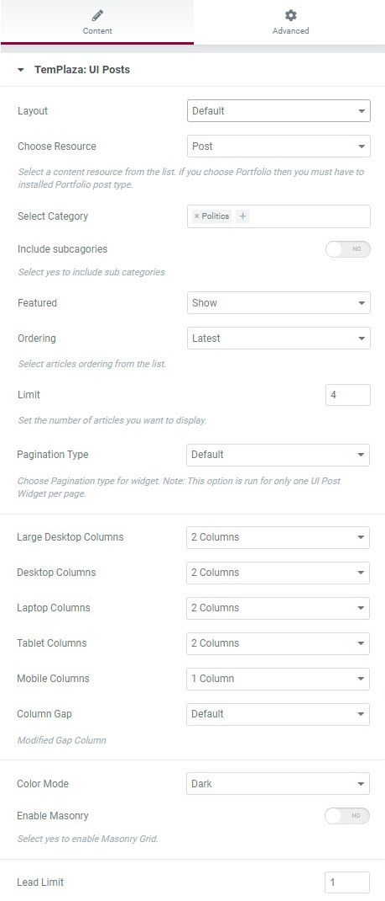
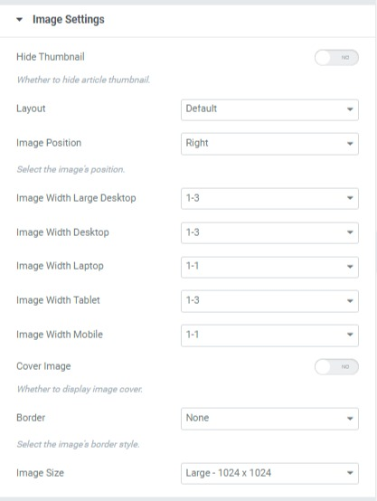

# Blog pages

Blogs pages of the theme were created with UI Posts element. Asa result, to get a blog page, you're supposed to create a new page > edit the page with Elementor > drag & drop UI Posts to the appropriate row and start to configure.

* Choose article resource
* Select categories
* Choose articles order
* Limit articles

## Blog Columns:

To create blog columns, you should configure the large desktop columns, desktop columns, laptop columns, tablet columns, mobile columns

## Blog Masonry

To get the masonry layout, you should enable the Masonry option

## Blog Image Left & Right

If you're interested in displaying articles' images on the left or right, go to the Image Settings > Choose Image position (left or right)

