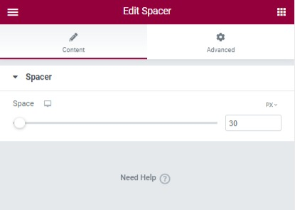
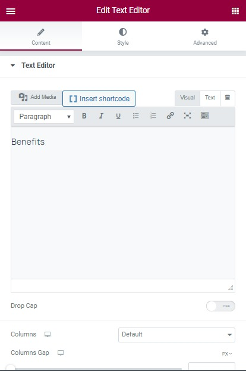

# Home

## Separator

You should edit the page with Elementor > Click on the element > Edit the space of the separator

Then go to Advanced > Mask > Enable mask and choose a shape. If you want to use a custom style, select the custom option and upload your own image.

## Heading Meta

Edit the page with Elementor > Edit the element "Text Block" > Edit the text. 

* To change the background color of the heading meta, you should go to the Advanced tab > Background >  Change the color.
* To change the text color, you should go to the Style tab > change the text color

## Testimonials

To change the color of this section, you can edit the element > Style tab > here you can edit the color of the quote icon, avatar border, content, title, author, designation, next/preview color, and hover color. 

