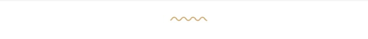

# Yachts

## How to change the archive style

Amanus theme comes with 5 different archive styles. You can go to Amanus Options > Settings >  Advanced product options > Advanced product loop > Choose an inventory layout from the list.

## How to change the slug of the yachts page

You should go to WP-Dashboard > Settings > Permalink > Optional > Advanced Product archive slug > change the slug

After that, go to Appearance > Menus > edit your main menu > toggle Yacht menu item > Edit the custom link to match the slug changed in the permalink settings. 

## Sidebar Yacht Filter

The yacht filter is one of the widgets of the theme that is created with TemPlaza - Advanced Products Filter. You can easily find it in the widgets section. 

* Plz go to WP-dashboard > Widgets > Inventory Sidebar
* Click on the Setting icon on the right corner
* Then you can choose which custom fields could be displayed in the filter

## Currency Settings

To change the currency for advanced products, you're supposed to go to WP-admin > Advanced Products > Settings > General.

Here you can choose a currency symbol, symbol placement, thousand separators, decimal separators, and number of decimals.

