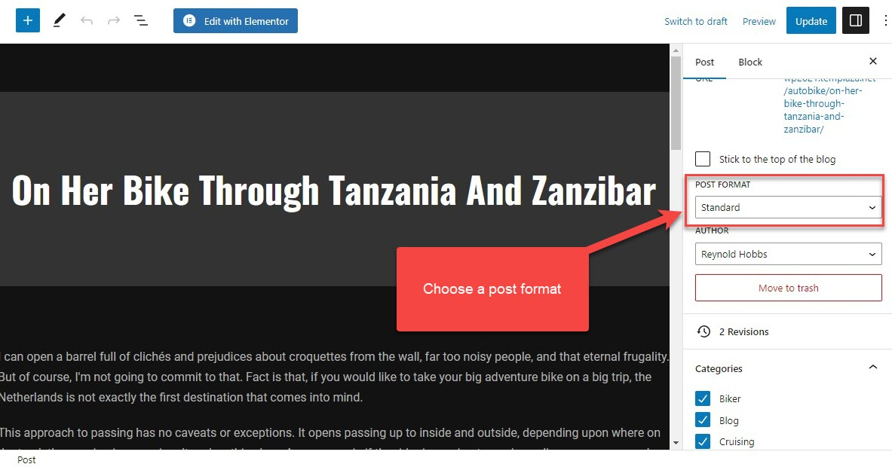
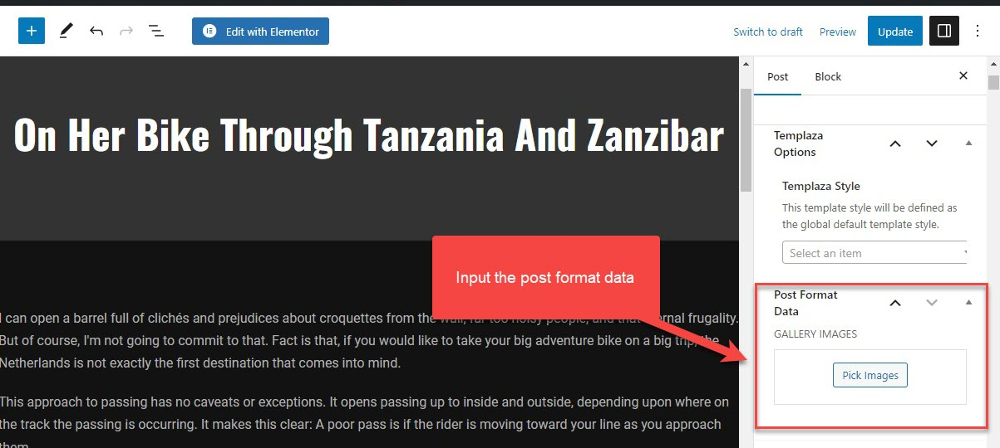
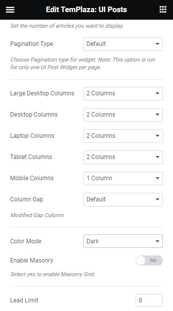
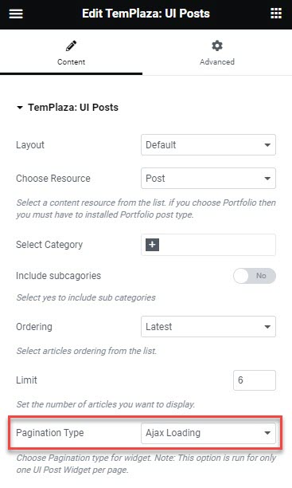

# Blog

The theme supports 5 post formats: Standard, Audio, Gallery, Link, Quote and Video. They will help you easily make a microblogging website.

## 1.Create A New Post

Follow the steps below to create a new post:

1. Go to Posts
2. Click on the Add New button
3. Input the post title and post content (You can also create a post's content with Elementor)
4. Choose the post format and category on the right-hand side
5. Scroll down along the right sidebar, you will see an option to input the post format data in case you choose Gallery, Link, Video, and Quote.

> Go to Elementor plugin > Settings > Post Type > Checkbox the Post type to enable Elementor editor for posts. 

Enable the Elementor editor for posts

## Blog Columns

* Create a new page
* Assign the page to a template style that is created in the theme options > templates
* Input a title and edit the page with Elementor
* Use UI Posts to display your posts on the blog
* By editing the UI Posts, you can choose a layout, content source, category, post ordering
* Configure the number of columns on different devices

## Blog Ajax Load

* By editing the UI Posts, you can choose a layout, content source, category, post ordering and other options.
* Choose Pagination Type: Ajax Loading

