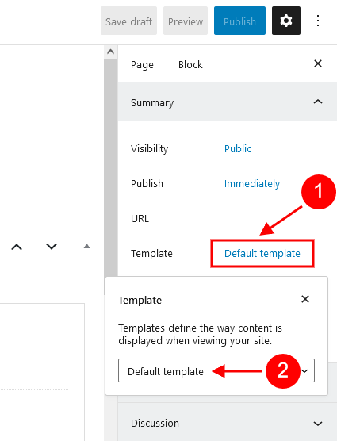
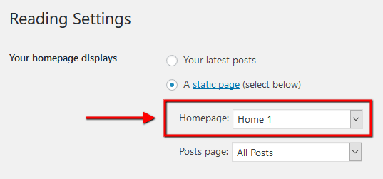

# Create a new page

To create a new page navigate to the "Pages" dashboard menu item in your WordPress admin panel and click on Add new button.

## Page Templates

Choose either the "Blog Archive" (blog page) or "Default Template" (regular page) option in the Summary > Template sidebar.

## Assign a page to a TemPlaza style

When editing a page, you can see TemPlaza options on the right side. Assign the page to a specific template style or it'll be inherited from the settings if you leave it blank. 

> You can find all the template styles in the Theme Options > Templates

## Elementor Page Builder-related tutorials

Usually, the page consists of Sections, Columns, Widgets and some other elements that can be edited via Elementor. Before you start, please check the following tutorials:

1. [Official Elementor Tips page](https://elementor.com/help/tips-tricks-more/)
2. [Getting Started With Elementor](https://elementor.com/help/getting-started/)
3. [Official Documentation for Elementor page builder](https://elementor.com/help/)
4. [Official Elementor Video Tutorials](https://www.youtube.com/c/elementor)

## Assigning a Page as a Homepage

Once you finished building your page, assign it as a Homepage:

1. Navigate to **Settings > Reading** menu item in the WordPress dashboard menu.
2. In **Your homepage displays** section select A static page (select below) option and choose the necessary page from the Homepage drop-down list.
3. Save the changes.

