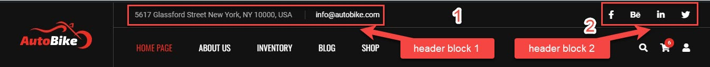
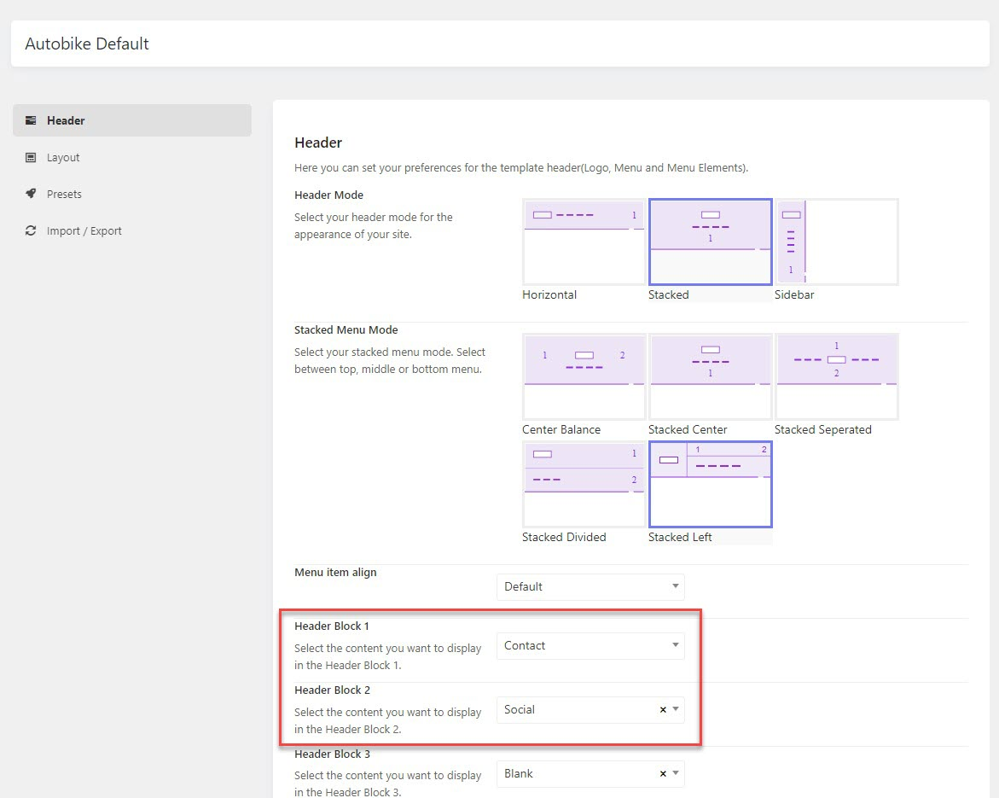
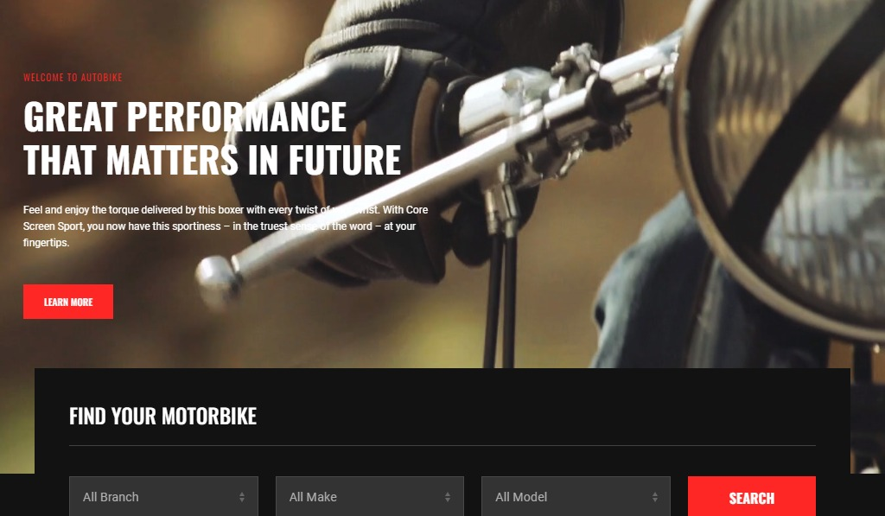

# Home page 1

1. **Header:** The header area style is set in the theme options > Headers > Autobike Default > Choose a header mode and stack menu mode.
Home 1 on our demo was created with Stacked Left menu
2. **Contact info:** (assigned to header block 1) To edit the contact info, you should go to theme options > Settings > Miscellaneous > Contact
3. **Social Icons:** (assigned to header block 2) To edit the social icons, you should go to theme options > Settings > Social

## Header Icons

In the header section, you can see options to enable or disable the search icon, account icon, and cart icon. Change the icon size

## Slider & Bike Search

> A header is set as default will be the primary header style of the website. You can create different headers and assign them to different pages

