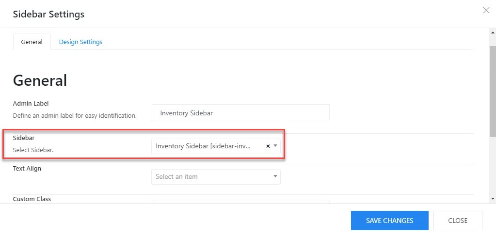

# Inventory Filter

You should go to **Appearance > Widgets > Edit the Inventory widget.**

The inventory filter was created with TemPlaza - Advanced Products Filter which allows you to add different advanced products filters according to custom fields (ex: Branch, Make, Model, Manufacturer, Price, Year and so on).

## Configure the Inventory sidebar in the layout

Please go to Autobike Options > Templates > Autobike Inventory > Layout > Edit the sidebar and assign it to the inventory widget.

You can move the sidebar element to any position you want in the layout by dragging and dropping the element. 

