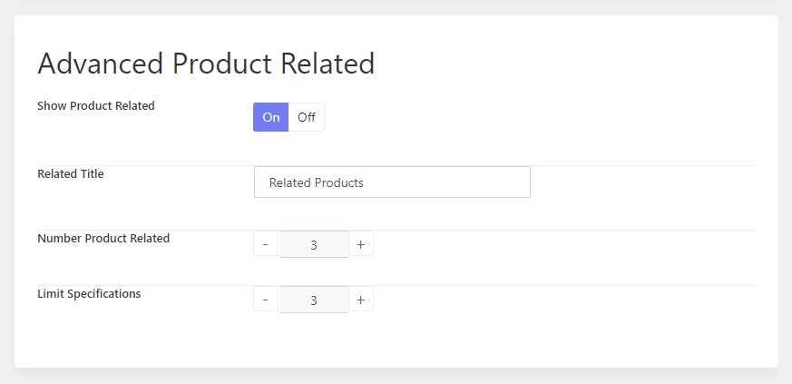

# Advanced Product Options

The theme offers many helpful options to configure the inventory page. You can find them in **Autobike Options > Settings > Advanced Products options.**

Here you will see options to configure:

## Advanced Product Archive

## Advanced Product Loop

## Advanced Product Single

## Advanced Product Compare

The theme supports 5 styles for the compare layout. You can choose one of the available styles on the drop-down list. 

## Advanced Product Related

Here are some options for related products that are displayed on detailed product pages. 

## Advanced Product Badges

Here are available options to configure item badges of products on the inventory list pages, such as: **For Sale, For Rent, All, Sale / Rent.**

## Advanced Product Quickview

You can choose field groups to be displayed in quick view.

