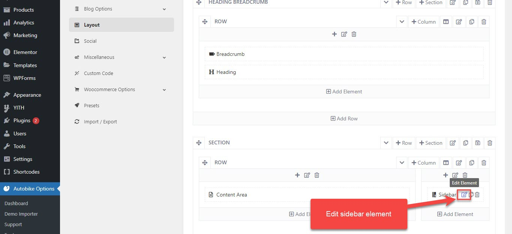
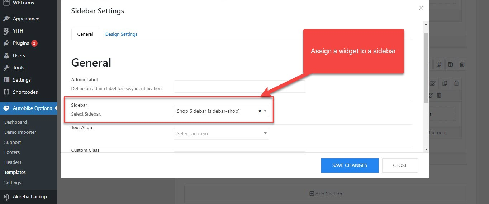

# How to add the widget to a sidebar

To display a widget on a sidebar, you should go to Theme Options > Templates > Open your template (ex: Shop layout template) > Layout

Edit the sidebar element > Choose a widget for the sidebar

Edit the sidebar element

Choose a widget for the sidebar
