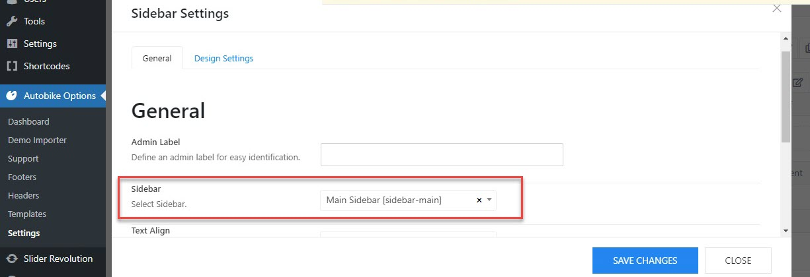
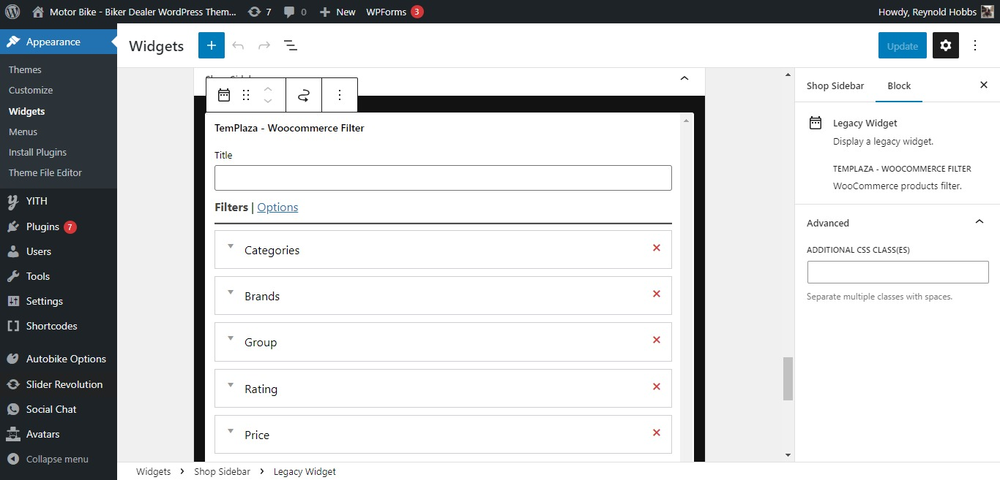
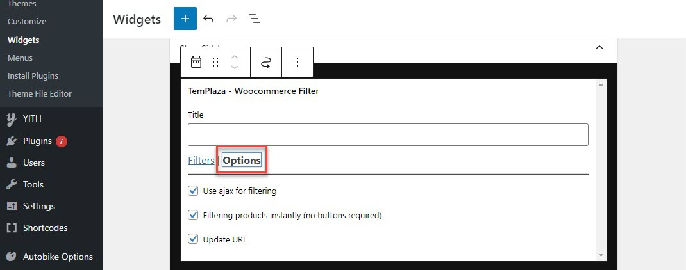
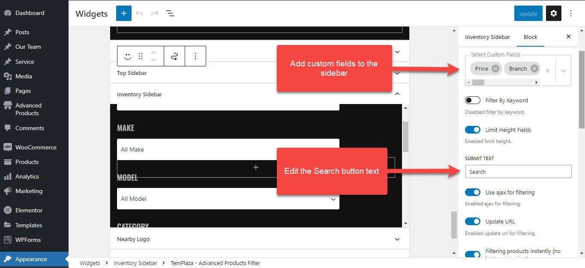
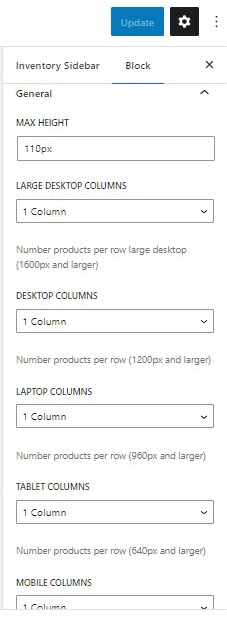

# Sidebar & Widgets

There are different pre-defined widgets that you can find in the Appearance > Widgets.

## Main Sidebar:

The main sidebar is usually located on the blog pages which are assigned to the default layout.
You can go to Autobike Options > Settings > Layout > Edit the sidebar > Choose a sidebar widget.

## Shop Sidebar

The shop sidebar is located on the shop page. It's built with TemPlaza - Woocommerce Filter which allows you to add various filters to the sidebar such as Category, Brand, Group, Rating, Price, and Tags. 

Click on "Add A New Filter" to add more filters to the sidebar.

Click on the Options tab > you'll see options:

* Use ajax for filtering
* Filtering products instantly (no buttons required)
* Update URL

## Inventory Sidebar

You can find the inventory sidebar on the Inventory page. This sidebar was created with TemPlaza - Advanced Products Filter which allows you to add different advanced products filters according to custom fields (ex: Branch, Make, Model, Manufacturer, Price, Year and so on) 

* Select custom fields:  add custom fields to the sidebar.
* Filter by keyword: enable it if you're interested in showing a field to search products by keyword.
* Limit Height Fields: Enable it to limit the height of fields.
* Submit Text: you can edit the Search button's text here.
* Use Ajax for filtering: Enable the option to activate ajax filtering which will hide the search call-to-action button
* Update URL: Update the url when filtering custom fields.
* Filtering products instantly (no buttons required):

**General Options**

* Max height: the height of the filter if it's not expanded (See less).
* Below max height are options to configure the number of columns (number of products per row) on different devices: large desktops, desktops, laptops, tablets, and mobile phones.