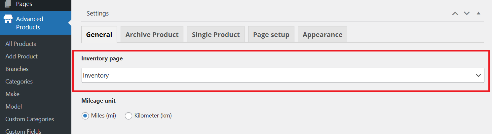
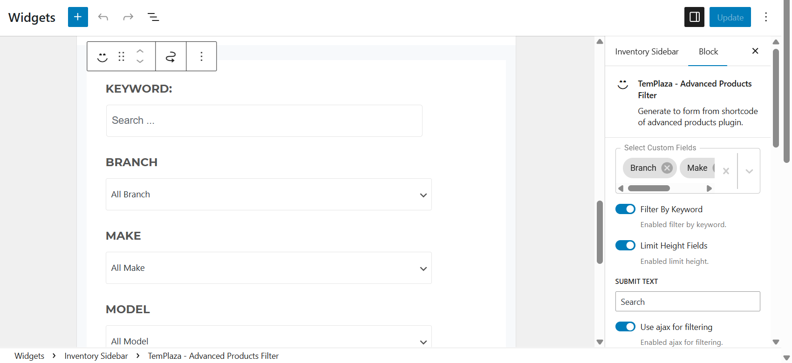
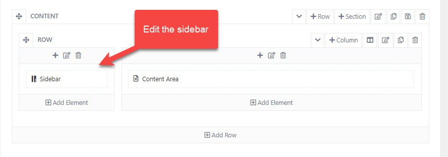
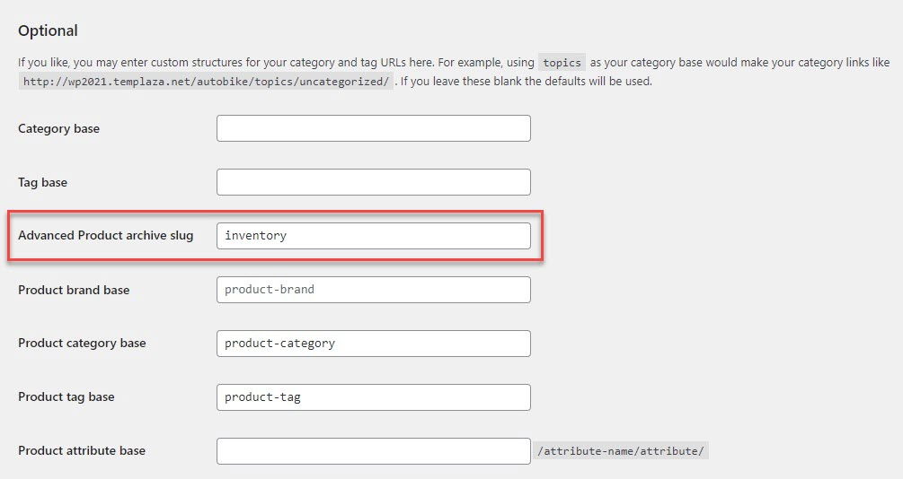

# Inventory
## Inventory Page Assignment
We built the inventory data with Advanced Products plugin, so you should make sure this plugin is installed on your site.
To have an inventory page, you're supposed to go to Pages > Add New > Create a new page for Inventory.

In the right sidebar, you will see TemPlaza Style option, and you should choose the Inventory style for the inventory page.
After that, go to WP-admin > Advanced Products > Settings > Choose an inventory page.

## Inventory Product Filter
You should go to Appearance > Widgets > Edit the Inventory widget.
The inventory filter was created with TemPlaza - Advanced Products Filter which allows you to add different advanced products filters according to custom fields (ex: Branch, Make, Model, Manufacturer, Price, Year and so on). 

### Configure the Inventory sidebar in the layout
Please go to Auto Showroom Options > Templates > Layout Inventory > Layout > Edit the sidebar and assign it to the inventory widget.

You can move the sidebar element to any position you want in the layout by dragging and dropping the element.
## Change Inventory Permalink
To change the permalink of the Inventory page, you can go to Wp-admin > Settings > Permarlinks > Optional > Edit Advanced Product archive slug. 

Then go to Appearance > Menus > Edit the main menu > Toggle Inventory menu item > Change the custom link according to the newly changed slug above.

Ex: Advanced Product archive slug is set "ap-product"  default, if you change it to "inventory" then
the product url will be: http://www.yourdomain.com/inventory/product-1

## Pricing & Currency Setting
To change the currency for advanced products, you're supposed to go to WP-admin > Advanced Products > Settings > General tab
Here you can choose a currency symbol, symbol placement, thousand separators, decimal separators, and number of decimals.

