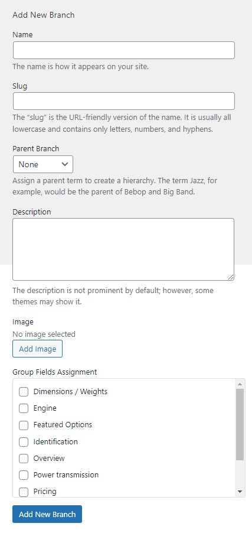

# Inventory
We built the inventory data with Advanced Products plugin, so you should make sure this plugin is installed on your site.

## 1. Create product branches
**Creating a product branch is compulsory**, so you should not miss this step. Please go to WP-admin > Advanced Products > Branch.

On the left, you will see a form to create a new branch, let's enter the branch name and other info. 

Group field assignment: you should assign the branch to one or more custom group fields that are (are) created in the Custom Group Field section. 

## 2. Create custom field groups
Advanced Products uses field groups to attach fields to each product. 

* Please go to WP-admin > Advanced Products > Custom Field Group 

* You will see a form on the left to create a new Field Group. Enter the name of the field group and other info. 

* Associated Branch: Select one or more branches that connect with the field groups. 

