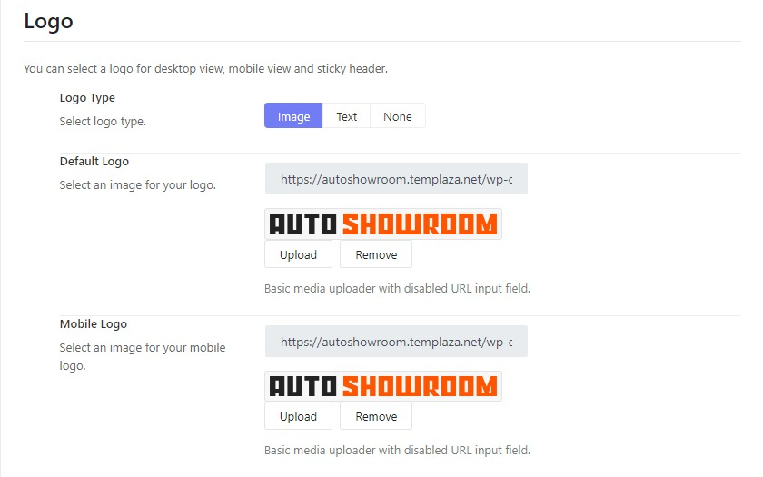
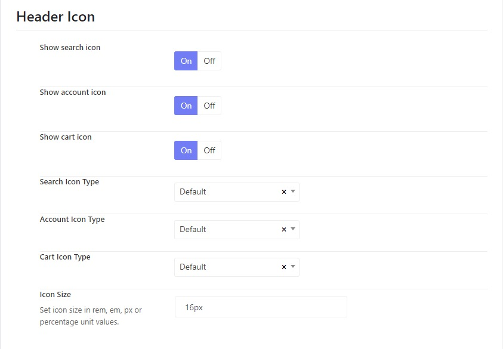

# Header

## Edit the Top Bar info (Phone number & Email Address)
To edit the info on the top bar including phone number and email address, you should go to AutoShowroom options > Headers > Edit each header in use > Layout > Edit the Info Text Block.
The Home page is usually assigned to the AutoShowroom Header absolute, while other pages are assigned to the Default header (the one is marked with the yellow star icon). So you're supposed to edit both the  header absolute and the default header. 

## Change The Logo
In the AutoShowroom Options > Header > Edit each Header in use > Header, you can change the header mode, and change the logo image.

## Change the icons on the header: Cart icon, Search icon, and Account icon

From the logo section, you can scroll down a little bit and find options for header icons.
There you can enable or disable search, account, and cart icons. Moreover, you're capable of changing their icon type and icon size. 

