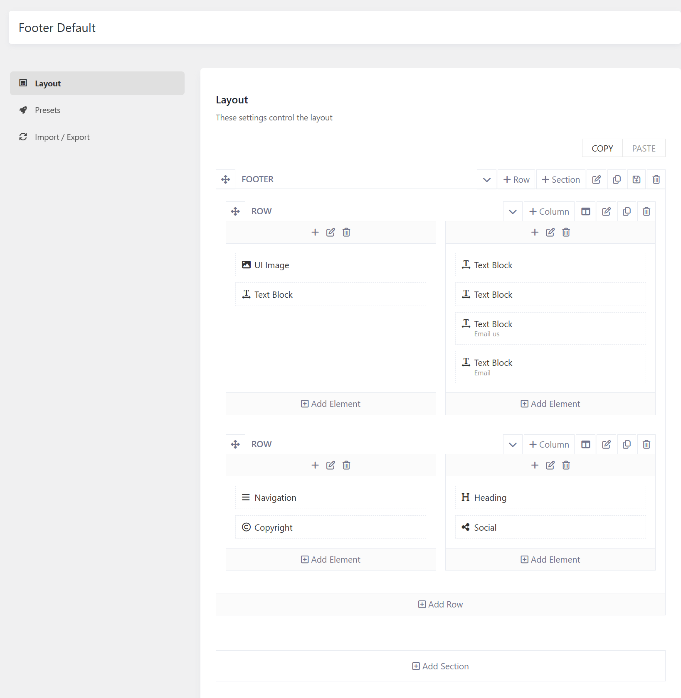
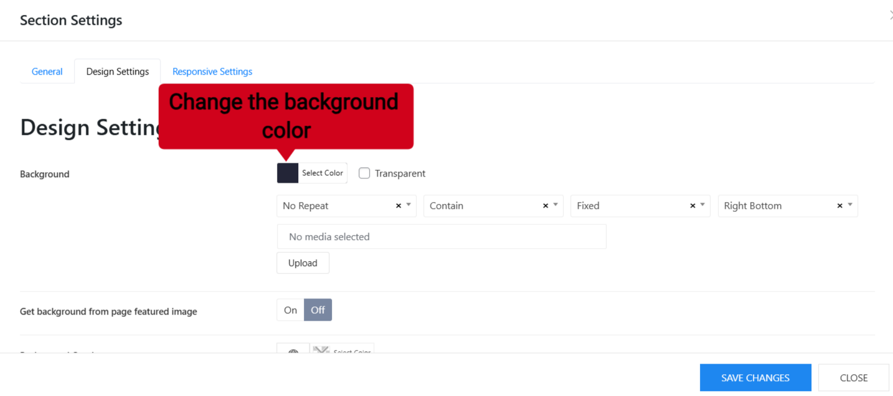
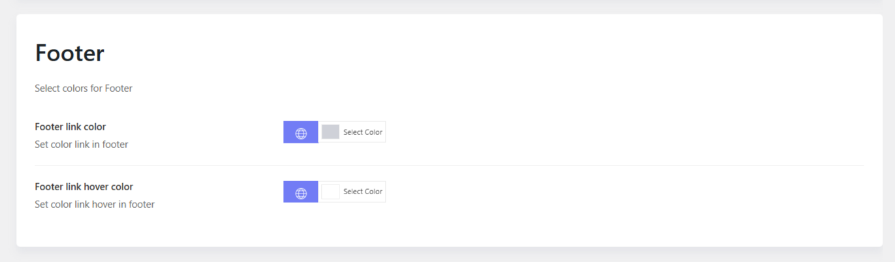

# Baressco Footer

## Footer layout

To change the footer content and manage the footer layout, please go to **Baressco Options > Footers > Edit a footer in use (the Default footer) > Layout.**
There you can see the layout built with different elements, you can edit elements such as UI Image, Heading, Navigation, and Text Block directly in the layout. 

**Social Icons:** To change the social icons, please go to **Baressco Options > Settings > Social** There you can add more social channels, or remove unnecessary ones.

**Copyright:** you can go to **Baressco Options > Settings > Miscellaneous > Copyright.**

You can also use a text block to display the copyright.

## Footer Background Color

To change the black background color of the footer, you can easily edit it from the footer layout. 

Please edit the **Footer section > Design Settings** > Change the background color there. 

> Please edit the Footer section, not edit an element, a column or a row. 

## Footer Color

You can go to **Baressco Options > Settings > Colors > Footer**. Here you can change the link color, and link hover color of the navigation links in the footer. 

