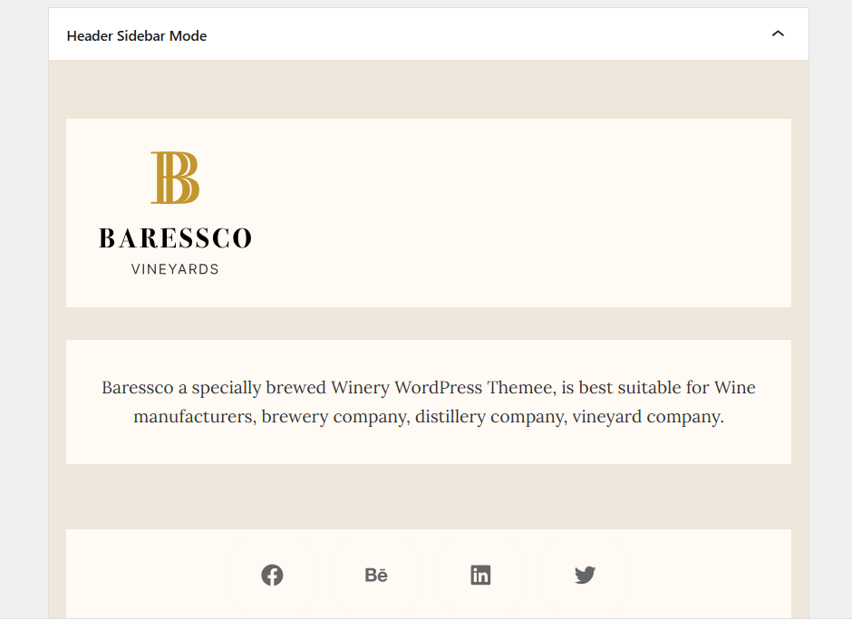

# Baressco Headers
At the moment, there are 3 prebuilt header styles:

Header home 1 (Default header)- Horizontal Center

Header Home 2 - Transparent Header

Header Home 3 - Stacked Center

## Change the header mode and menu type
To select a header mode, please go to Baressco Options > Headers > Edit each header in use > Header > Select a Header Mode, and Menu Mode. 

To edit the theme's header, you should go to Baressco Options > Headers > Edit each header in use > Header > Change header mode and menu mode.

### Transparent header
From the header mode options section, you can see the option "Header Absolute". You can enable this option to make the header transparent.

## Change the Logo
In the Baressco Options > Headers > Edit each Header in use > Header > Logo Section, and you can change the logo type, default logo, and mobile logo.

## Change the icons on the header: Cart icon, Search icon, and Account icon

From the logo section, you can scroll down a little and find options for header icons.
There you can enable or disable search, account, and cart icons. Moreover, you're capable of changing their icon type and icon size.

## Off-canvas Menu

Please go to Appearance > Widgets > Toggle the Header Sidebar Mode > Edit the elements. 

After that, you should go to Baressco Options > Headers > Edit each header in use > Header > Off-canvas Menu > Choose Offcanvas Sidebar

