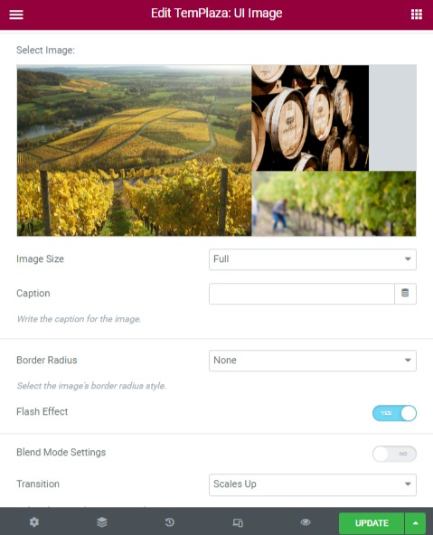
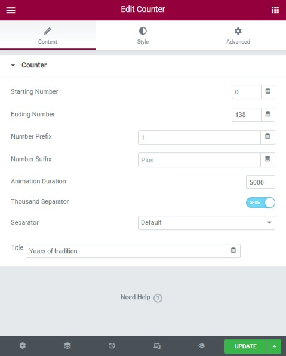
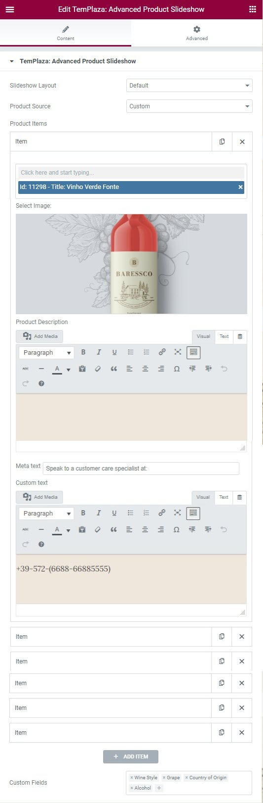
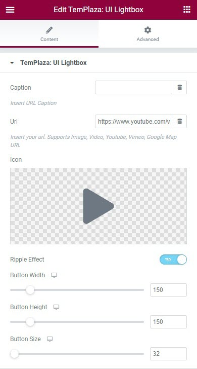

# Home page

> Here below are detailed instructions on how to edit each section of the home 1. Please follow us to know to

## Templaza style

This home 1 is assigned to Home style. Please go to Wp-admin > Pages > Edit your Home page > On the right sidebar, scroll down you will see TemPlaza Style > Select a style there

Now let's start to build and edit your home page with Elementor.

## Section 2

In this section, we use the elements: Templaza - UI Image, Templaza - Heading, Text Editor, and Button.

## Templaza - UI Image

* Edit the image by choosing another one from the library,
* Choosing an image size from the option list
* Enabling or disabling Flash Effect
* Transition: Scale Up or down

To edit the background image of this section, please click to edit the section > Style tab > You'll see an option to change the image.

## Section 3

This section uses the Counter element. Create a new section with a number of columns required, and add the Counter element. Then configure available options: starting number, ending number, title ...

## Section 4

This section was built with TemPlaza - Heading, Text Editor, TemPlaza Advanced Product Slideshow

## TemPlaza Advanced Product Slideshow

## Section 5

This section is built with TemPlaza: UI LightBox element. 

