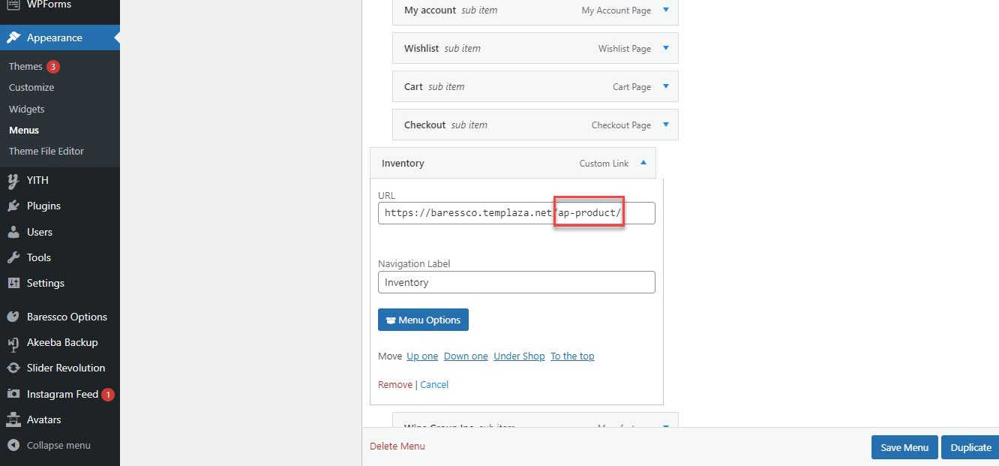

# Inventory

> The inventory page can be created by a custom link or a specific page. Please follow one of these ways below to showcase your inventory page. 

## Create Inventory menu by a custom link

* Please go to WP-admin > Appearance > Menu > Edit the main menu
* Add a custom link to the menu
* Insert the custom link url `https://yourdomain/ap-product/`, then the inventory page will automatically be shown in the front-end. 

Ex: your domain is http://abc.com, then the custom link should be http://abc.com/ap-product

## Create An Inventory Page
* Go to Pages > Add a new page for the inventory.
* Choose the TemPlaza Style on the right sidebar > Choose the Inventory template
* Go to Advanced Products plugin > Settings > Choose an Inventory page (Choose the inventory page created above).

## Global Settings 
You should go to Baressco Options > Settings > Settings > Advanced Products Options
* Advanced Products Archive Style: Choose Inventory style
* Advanced Products Single Style : Chooose No Sidebar style

