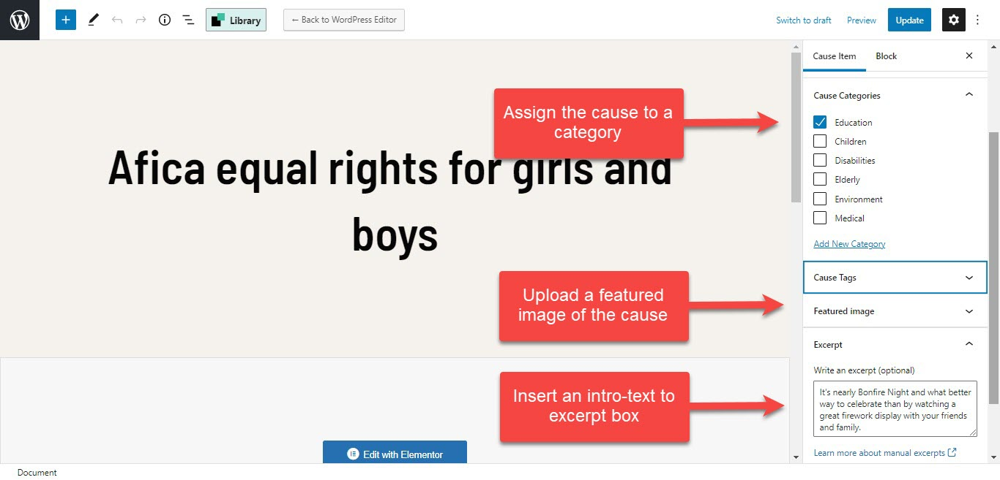
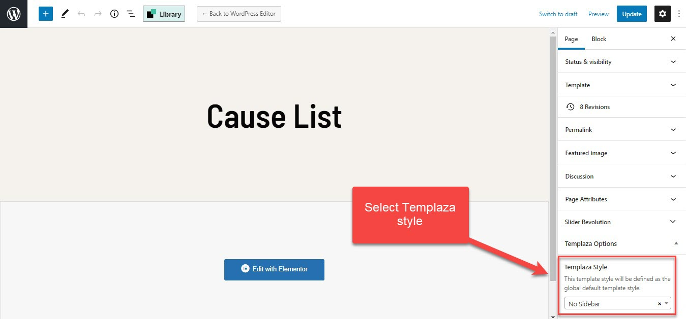
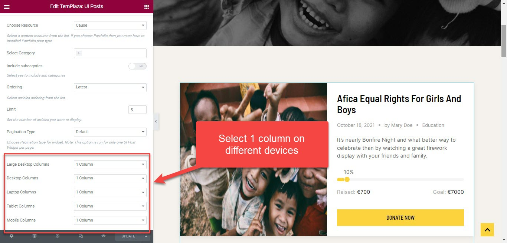
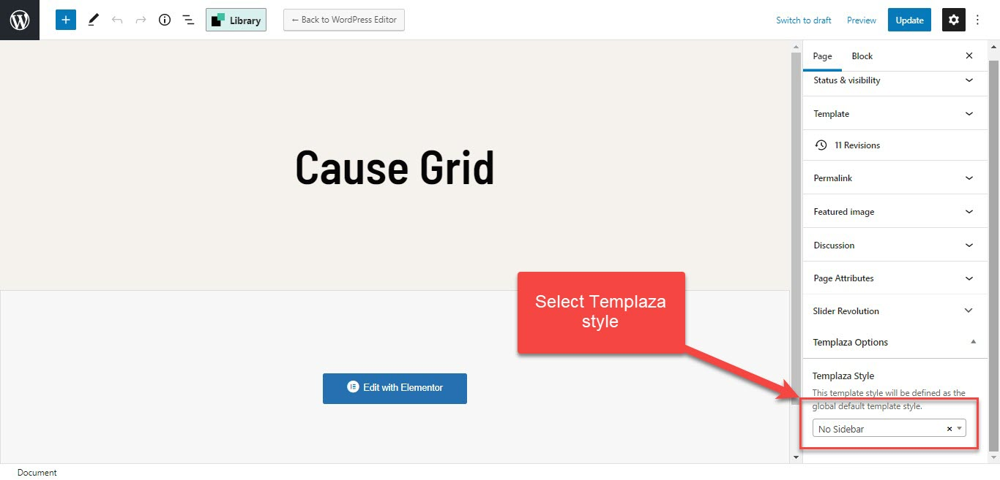
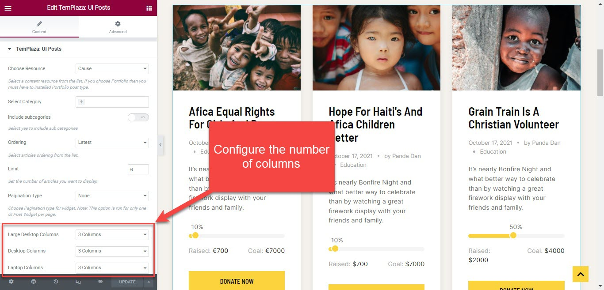

# Cause Settings

## 1.Configure Donate Settings

You should go to Wp-dashboard > Cause > Settings. Here you can configure the Paypal settings and Donate Steps

In case you want to customize the donated amount, you can edit each cause article > and configure the cause options there. 

## 2.Global Cause Options

Go to WP-Dashboard > Golden Hearts Options > Settings > Settings > Cause Options

You can see options to choose Cause layout, number of columns, column gap, number of causes per page, number of related causes and others. 

## 3.Donate button on the header

You should go to Golden Hearts Options > Header > Header Icon > Enable or disable Donate button

You can edit the Donate button text and choose a featured cause linked to the button. 

## 4.Causes List

### Causes articles

To create the Causes - List page, you're supposed to create causes articles first.

* Please go to **wp-admin > Cause > Add new**
* Enter the cause title
* Assign the cause to a category
* Upload a featured image and add intro text to the excerpt box
  

### Create a Cause List Page

* Go to Pages > Add New. Here you create a new page
* Enter the page's title
* Select Templaza style: No sidebar
* Edit the page's content with Elementor
* Add a section, drag & drop UI Posts element to the section
* Select post resource: Cause and choose categories, ordering.
* Configure the number of columns on devices with 1 column only

### Create a Cause Grid Page

* Go to Pages > Add New. Here you create a new page
* Enter the page's title
* Select Templaza style: No sidebar
* Edit the page's content with Elementor
* Add a section, drag & drop UI Posts element to the section
* Select post resource: Cause and choose categories, ordering.
* Select post resource: Cause and choose categories, ordering, and number of columns on devices (should be more than 1 column)

