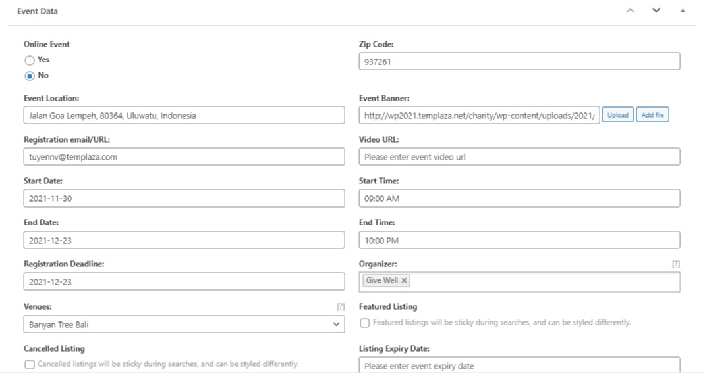
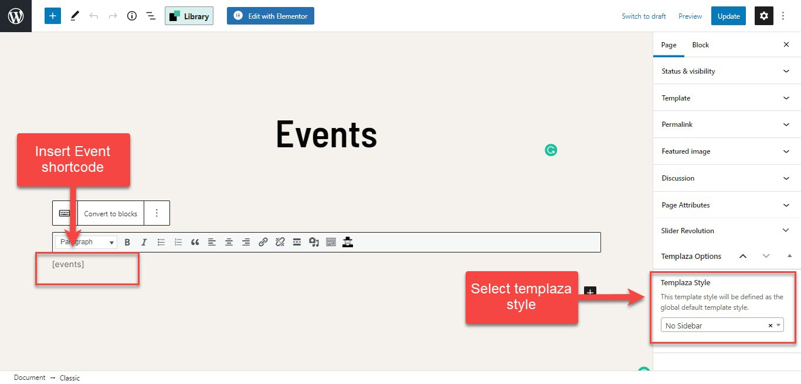
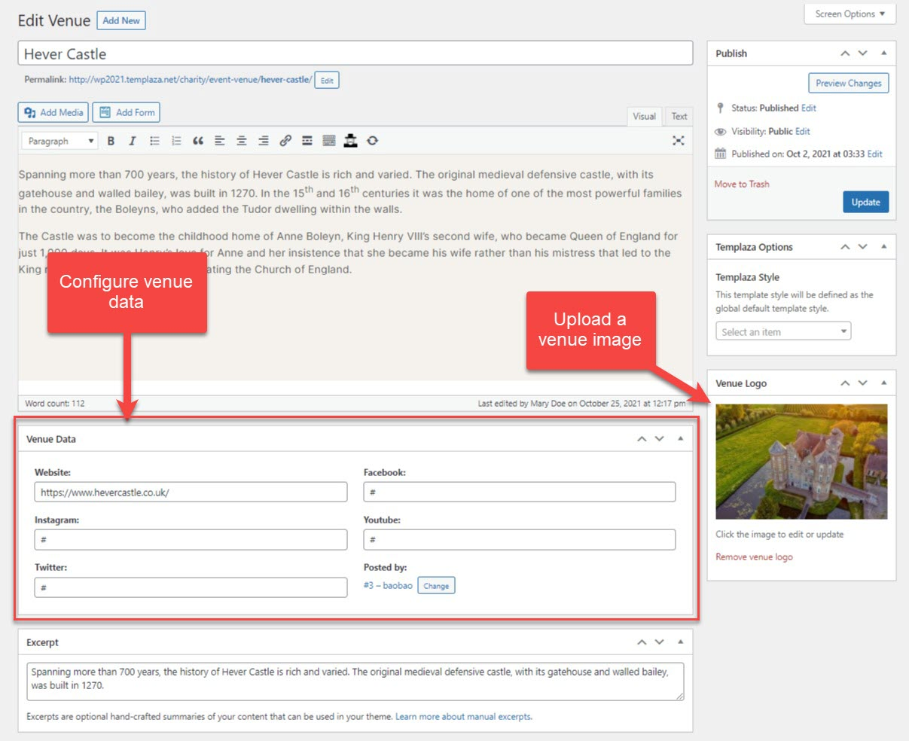
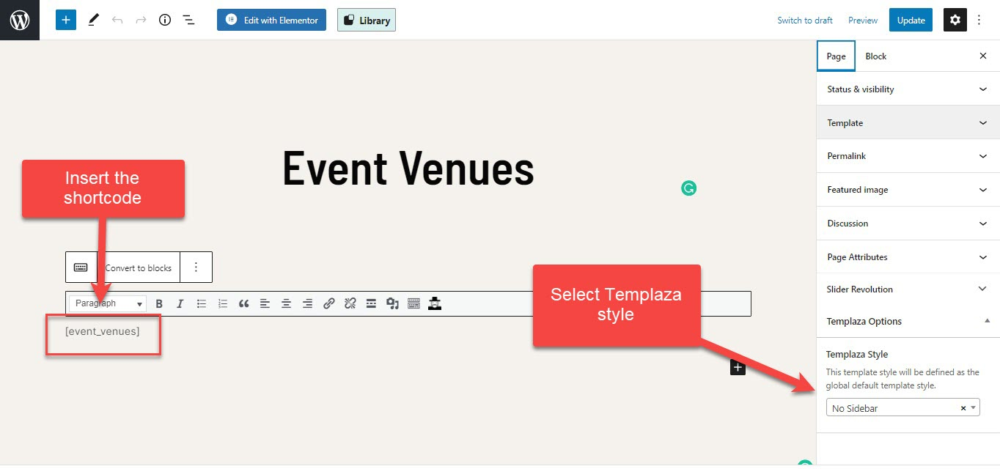

# Events

## Create Event articles

* Here you can enter an event's title and add your own content to each event article
* Upload a thumbnail image for the event
* Assign the event to a category

Please go to **wp-admin > Event manager > Add New**

## Configure Event Data

* Below the content section, you'll see Event Data
* Configure event data > then publish

## Create Event Page

* Go to Pages > Add New. Here you create a new page
* Enter the page's title
* Insert the shortcode `[events]`  into the page content-box
* Select Templaza style: No sidebar

:::note

You can assign the page to another templaza style and edit the correct style when you want to make changes to the layout. 

:::

## Event Venues

### Create event venues

Please go to **wp-admin > Event manager > Venues > Add new**

* Here you can enter an event venue's title and add a description
* Upload a venue's logo
* Configure venue data

### Create an Event Venue Page

* Go to Pages > Add New. Here you create a new page
* Enter the page's title
* Insert the shortcode `[event_venues]` into the page content-box
* Select Templaza style: No sidebar

## Event Organizers

### Create Event Organizers

Please go to wp-admin > Event manager > Organizers > Add new

* Here you can enter an event organizer's title and add a description
* Upload an organizer's logo
* Configure the organizer's data

### Create an Event organizer page

* Go to Pages > Add New. Here you create a new page
* Enter the page's title
* Insert the shortcode `[event_organizers]` into the content-box
* Select Templaza style: No sidebar

