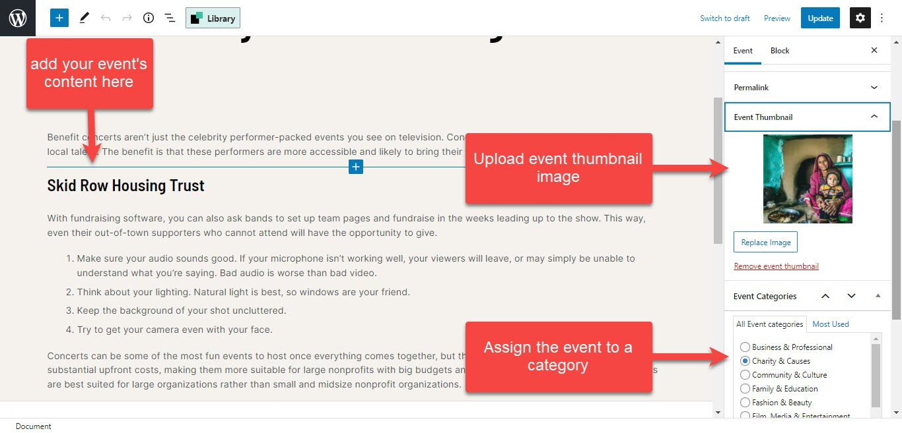

# Footer

## 1.Footer's layout

Please go to wp-admin > Golden Heart Options > templates > edit your template > layout:

Edit elements in the text block of Newsletter, "Connect with us" title

## 2.How to change the line below the Newsletter box

* Please edit the text block under Newsletter and social icons
* In the Design setting tab, change the border-color

## 3.How to change the Footer logo

Please edit the logo's text block in the Footer section, you can see the image below:

## 4.How to change the footer's background color

* Please click to edit the Footer Section > tab Design Settings
* Change the background color option

