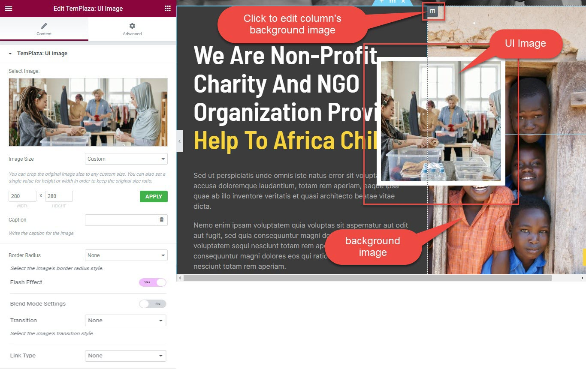
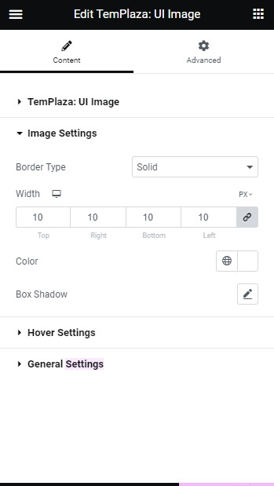
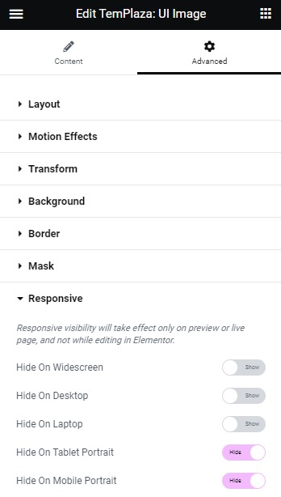
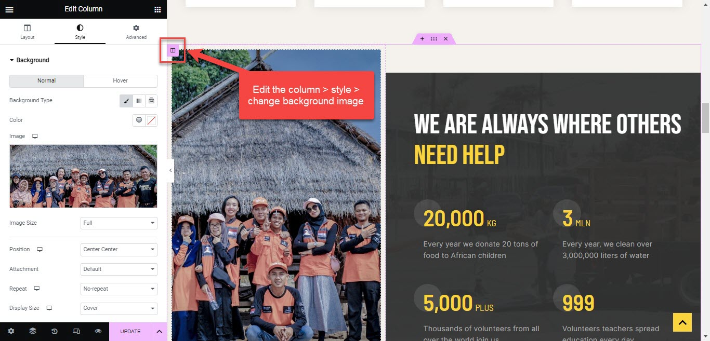

# Home Page

The Main Home page on the demo site was built with: **Slider Revolutions, Heading, UI Card, Counter, UI Text, Button, UI Lightbox, UI Post.**

* Go to wp-admin -> Pages -> Add New Page -> Edit with Elementor -> Publish
* Select TemPlaza style: Home page

## Configure Elementor widgets

### 1.Home Slider

Edit the slider, you can select the slide module, and add the shortcode below: 

`[rev_slider alias="slider-home-version-1" slidertitle="Slider Home Version 1"][/rev_slider]`

### 2.Social icons on the slide

Clicking on the social icons, you can edit the social icons info, shape, coumn and alignment. 

To change the icons' color, go to the Style tab > you can choose the official color or edit the custom color. 

### 3.UI Image

Editing the UI Image, you can change the image size

Down below in the Image Settings, you can choose the image's border type and border width.

You should open the Advanced tab > Responsive  > Configure the responsive visibility on different devices.

### 4.Change the column's background image

To change the background image of a column, you should click to edit the column > Style tab > change the background image. 

You can go to the Background Overlay > adjuts the overlay color

Edit the column's overlay color

### 5.Change the section's background image

About the backround image of a whole section, you should open the section's options > Style tab > change the background image. 

### 6.Donate button on the header
