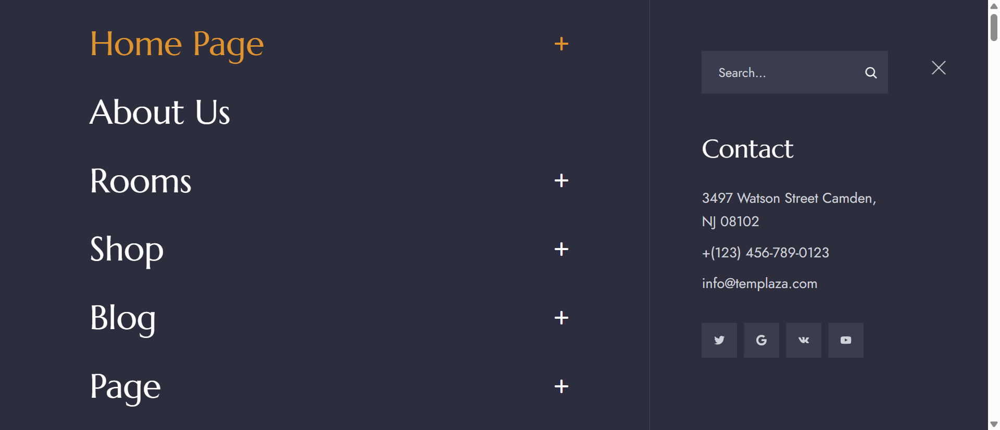
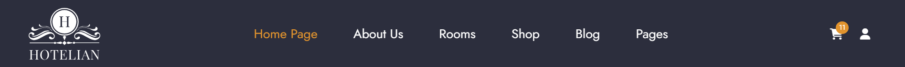
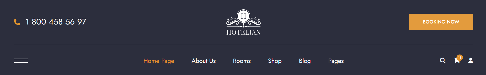
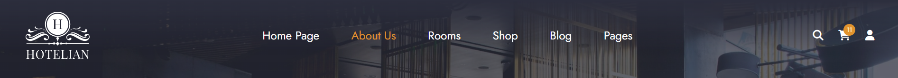
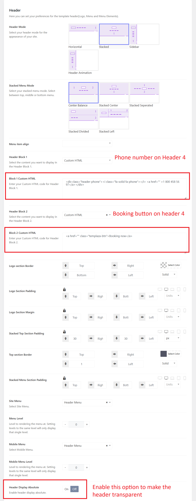
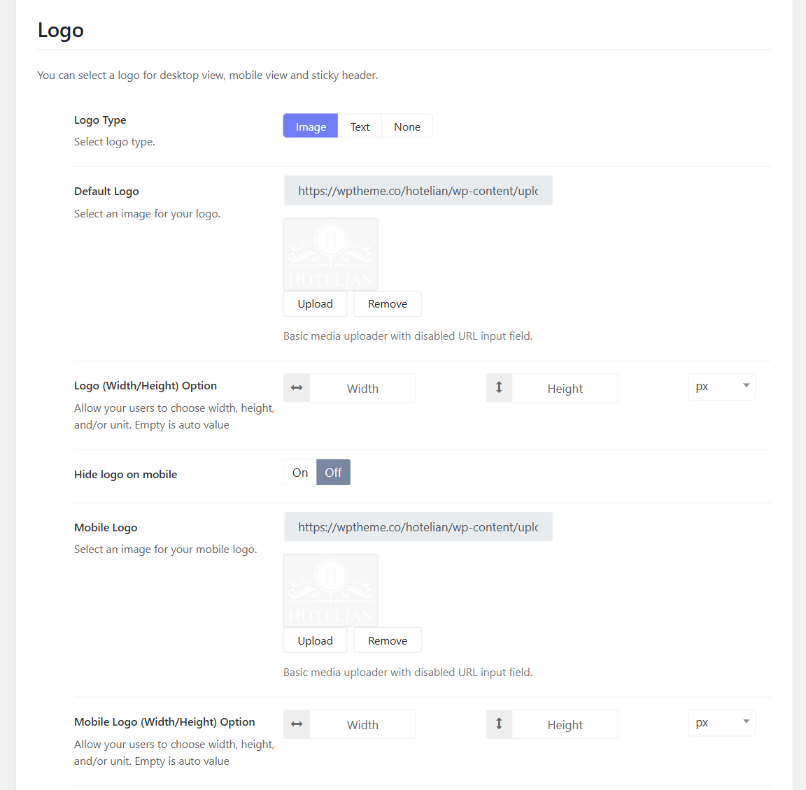

# Header
At the moment, there are 4 prebuilt header styles:

Header home 1

Header Home 2, Home 3, Home 5

Header Home 4

Default Header - Transparent Header (Assigned to inner pages)

## Change the header mode and menu type
To edit the theme's header, you should go to Hotelian Options > Headers > Edit each header in use > Header > Change header mode and menu mode. 

### Transparent header
From the header mode options section, you can see the option "Header Absolute". You can enable this option to make the header transparent.

## Change the Logo
In the Hotelian Options > Header > Edit each Header in use > Header > Logo Section and you can change the logo type, default logo, and mobile logo.

## Change the icons on the header: Cart icon, Search icon, and Account icon

From the logo section, you can scroll down a little bit and find options for header icons.
There you can enable or disable search, account, and cart icons. Moreover, you're capable of changing their icon type and icon size. 

