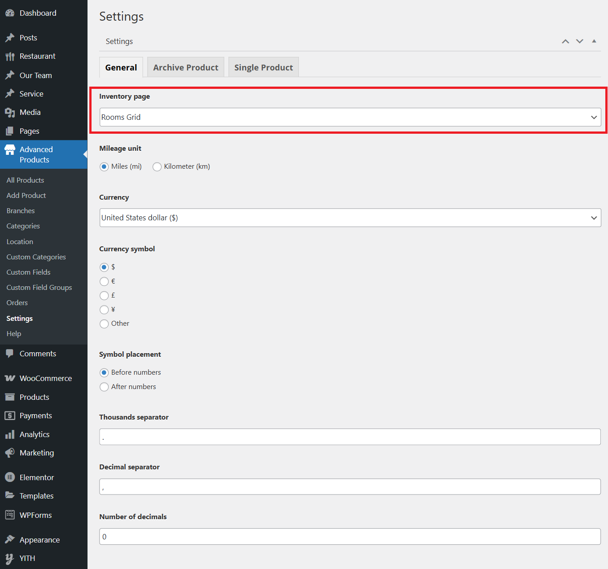
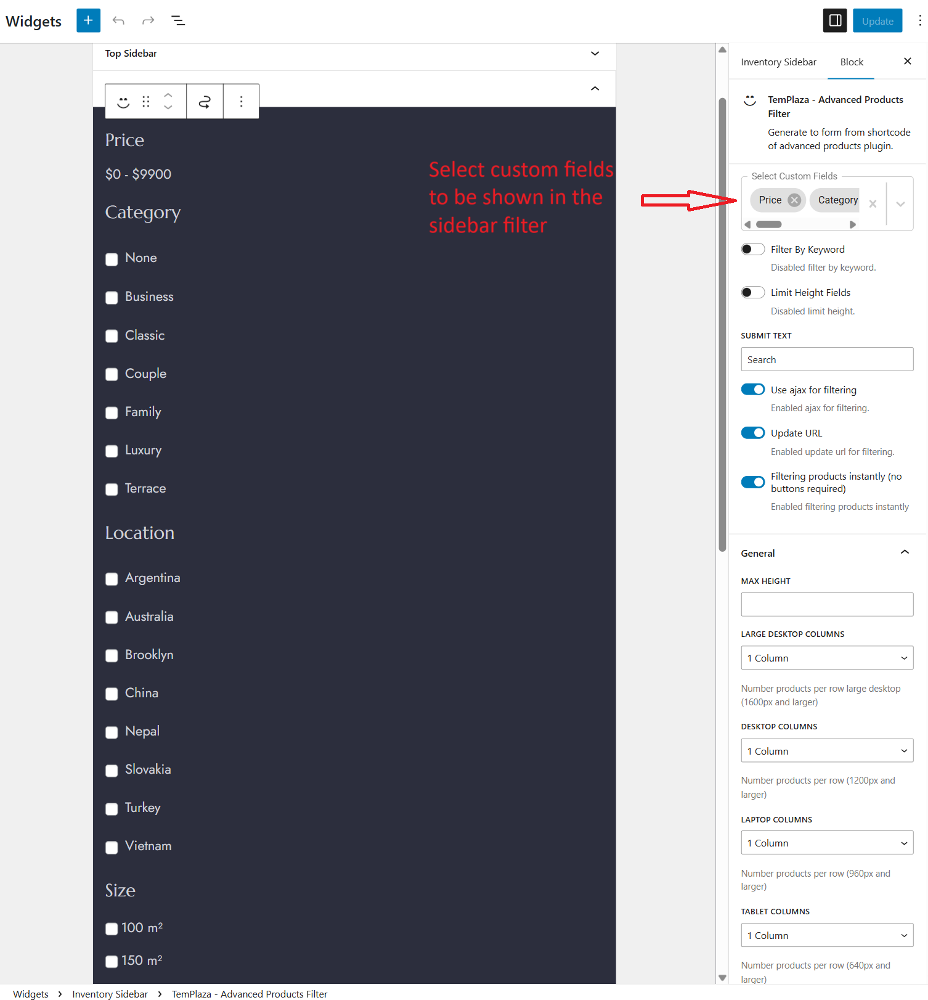

# Inventory - Room Grids

## Inventory Page Assignment
We built the inventory data with Advanced Products plugin, so you should make sure this plugin is installed on your site.
To have an inventory page, you're supposed to go to Pages > Add New > Create a new page for Inventory or use the prebuilt inventory page (Rooms Grid).
In the right sidebar of the page editor, you will see TemPlaza Style option, and you should choose the Inventory style for the inventory page.

After that, go to WP-admin > Advanced Products plugin > Settings > Choose an inventory page (Rooms Grid).

## Inventory Currency Settings
To change the currency for advanced products, you can find relevant options in the settings of advanced products plugin.
You can choose a currency symbol, symbol placement, thousand separators, decimal separators, and number of decimals (See the image above).

## Inventory Product Filter
You should go to Appearance > Widgets > Edit the Inventory Sidebar widget.
The inventory filter was created with TemPlaza - Advanced Products Filter which allows you to add different advanced products filters according to custom fields (ex:Price,Location, Categories, Size, Beds and so on).

### Change the position of the filter
Please go to Hotelian Options > Templates > Hotelian Room > Layout > Edit the sidebar and choose the sidebar widget.
You can move the sidebar column from the left to right or to any position you want in the layout. 

