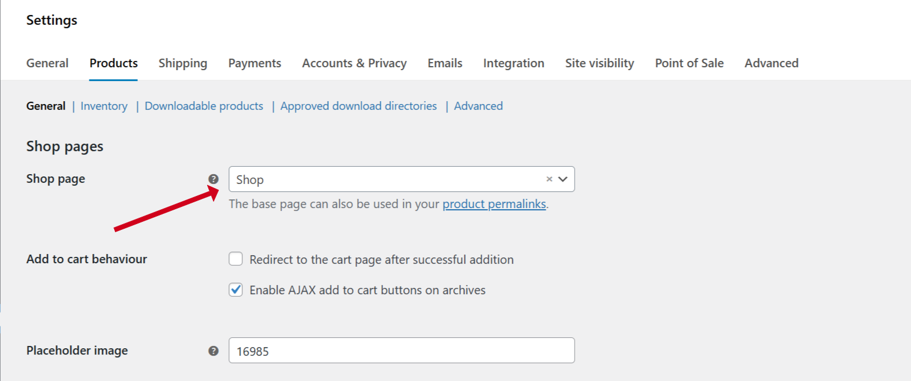
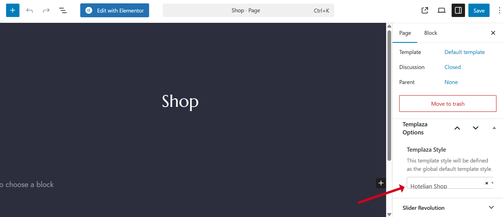
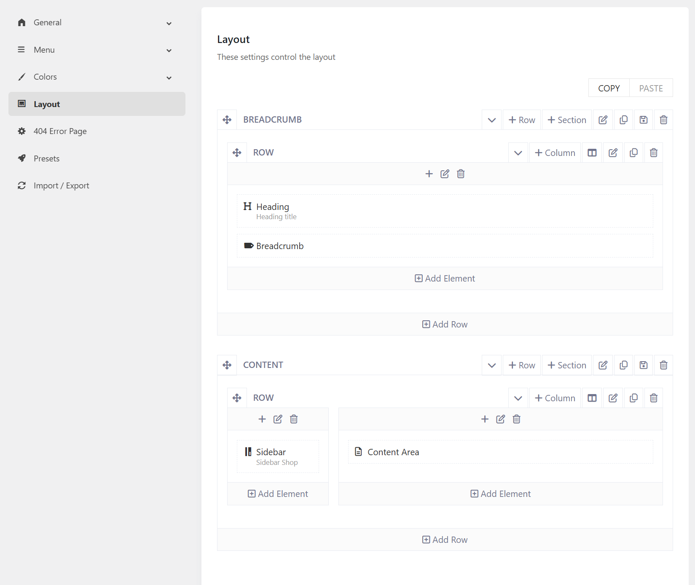
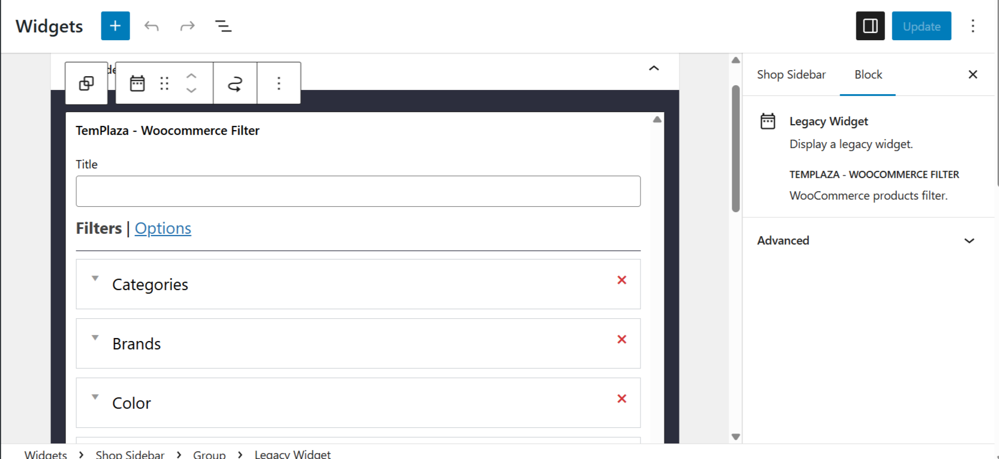

# Woocommerce Product Shop

## Choose a shop page
You should go to Woocommerce plugins > Settings > Product tab > choose a shop page. 

## Shop page - Template Assignment
You're supposed to go to Pages > Edit the Shop Page > Assign the shop page to a TemPlaza Style: Hotelian - Shop.

## Shop page Layout

The shop page is assigned to the Hotelian Shop template, so you can go to Hotelian Options > Templates > Edit the Hotelian Shop template > Edit the layout. 
By editing the layout, you're able to manage the layout by adding, deleting or reordering the elements. 

## Shop sidebar widget

To configure the shop sidebar, you should go to Appearance > Widgets > toggle the Shop Sidebar > Edit the widget. 
Add the TemPlaza - Woocommerce Product Filter to the sidebar widget and set up the filter options. 

