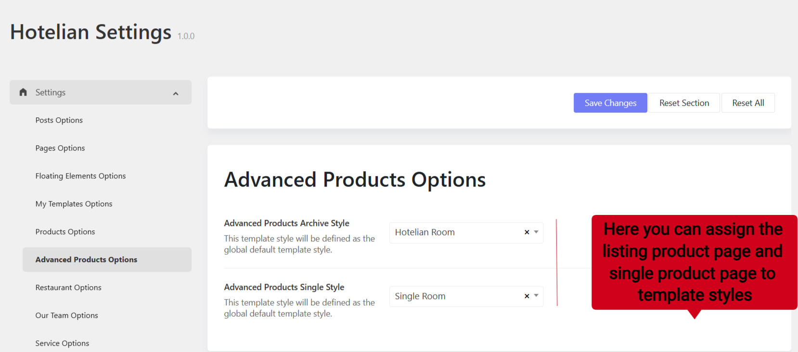
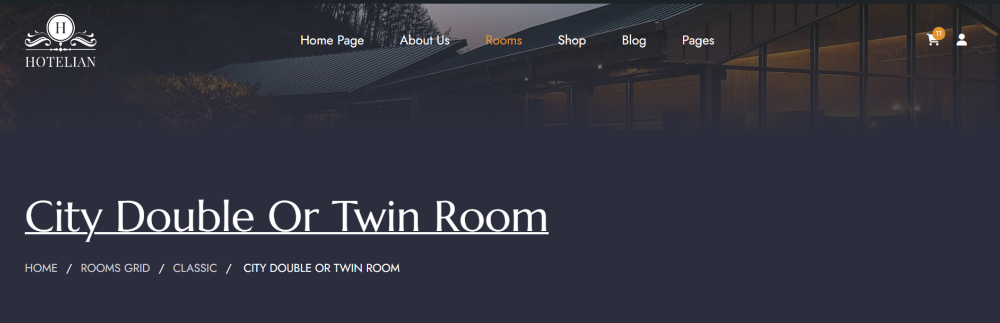
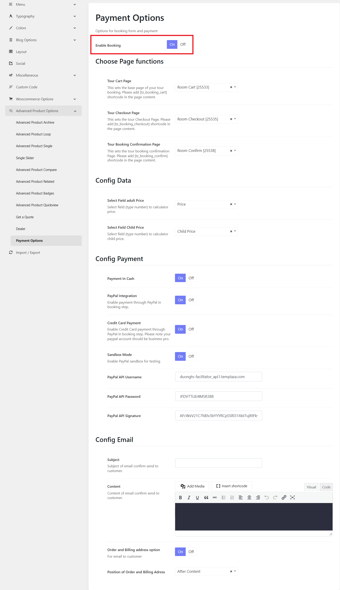
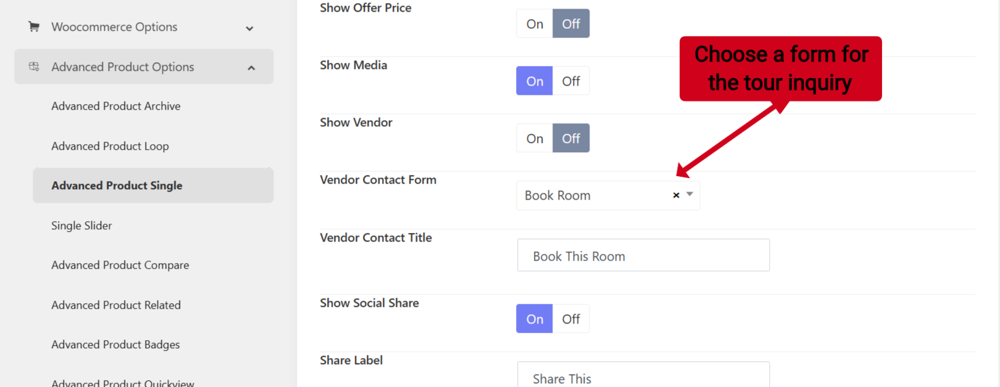
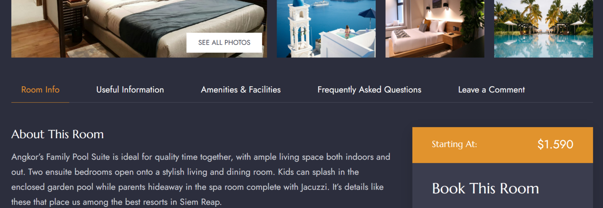
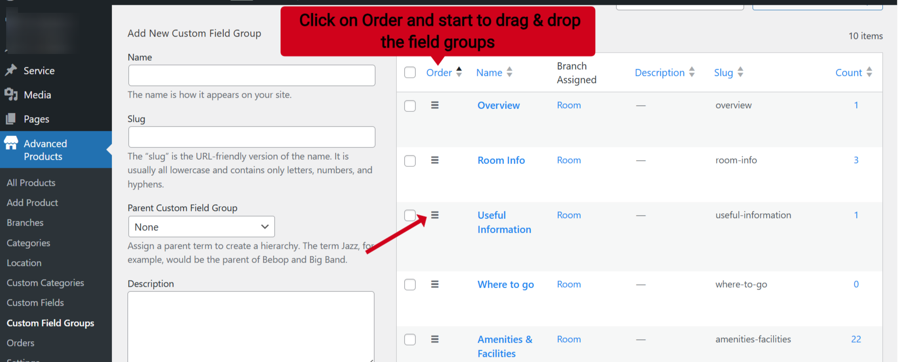

# Inventory - Single Room

## Single room template assignment

You can go to Hotelian Options > Settings > Settings > Advanced Products page > you can choose specific templates for the archive page "Room Grid" and for the single product page " single room"

## Header's background

The single room template is assigned to the Default header, so to change the background image of the header, you should go to Hotelian Options > Headers > edit the default header (with yellow star icon). 
Edit the header layout > Edit the section > Design settings > change the background image. 

## Booking Options
You can see the demo room booking coming with an online booking form and an inquiry form. 

### Online booking form
You can go to Hotelian Options > Settings > Advanced Products Options > Payments. Here you can enable or disable the payment options. 
If you enable the option, the booking form will appear in single tours. You can find settings relating to: page function, Email, booking data,and payment.

### Tour Inquiry
To enable the tour inquiry, please go to Hotelian Options > Settings > Advanced Products Options > Advanced Products Single. 
Here you can choose the Contact vendor form option (Choose Book Room form). This inquiry form was created with WPforms, so you're supposed to go to WPforms > edit the Book Room form. 

## How to change the order of tour feature tabs

To change the order of the feature tabs, you can go to Advanced Products plugin > Custom Field groups > Click on "Order" > Then start to drag & drop the hamburger icon in front of each field group to reorder its position. 

## How to disable the comment section

Go to Hotelian options > Settings > Advanced Products Options > Advanced Products Single > You can find the "Show Comment" option.
You can enable or disable the comment section on each single room page here. 

