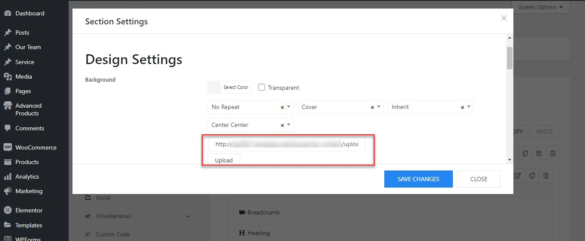
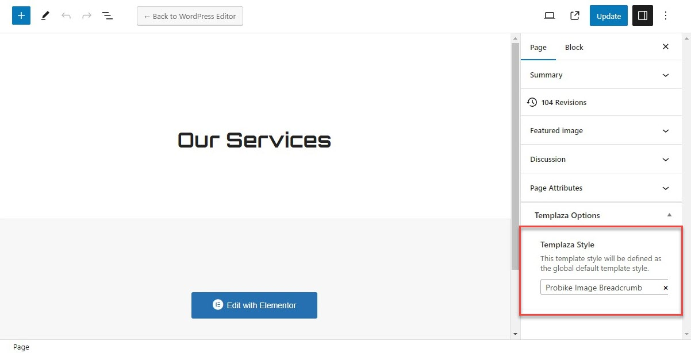

# How to change the breadcrumb image

You can see the breadcrumb section available on the inner pages and it contains a background image.

So to change this background image, please go to Kamper Options > Templates > Open the template.

* You should go to Kamper Options > Templates > ex: Kamper Fullwidth > Layout.
* Edit the Breadcrumb section > Design Settings tab > Change the background image.

## Create different breadcrumb images on various pages

In case you're not fond of having the same breadcrumb image on many pages, just read my below suggestion. 

You should duplicate a template into many versions, and edit the breadcrumb images of those duplicated ones. 

Go to Pages > Edit your pages > Assign a page to a corresponding template by choosing a TemPlaza style.

