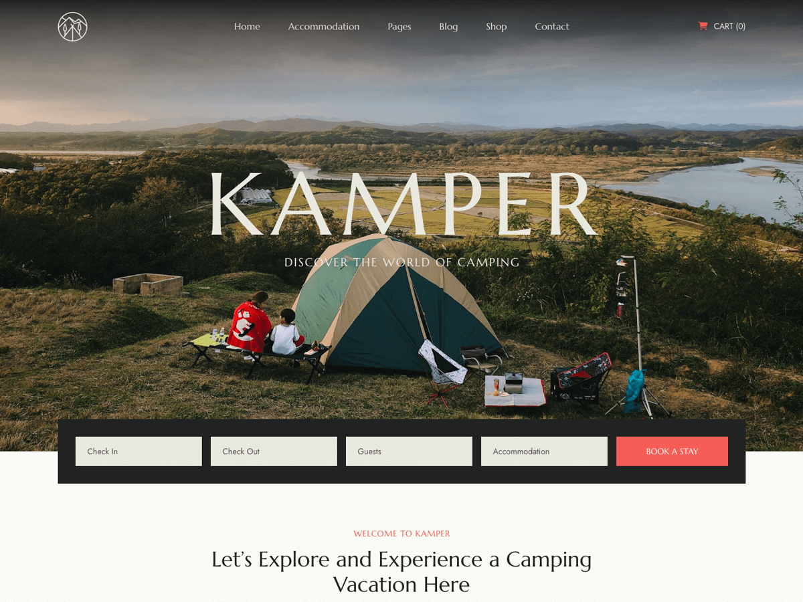

# Kamper Document

**Kamper - Camping, Travel & Tour Booking WordPress Theme**

Kamper is a modern and alluring Camping & Adventure WordPress Theme designed for camping, and campground, glamping, adventure, outdoor travel companies, rent camping facility services, hiking agencies. This theme comes with 12 beautiful demos homepages and other useful inner pages, as well as essential features ready to launch all sorts of camping sites.

Thanks to the support of the Advanced Product plugin, you will find it easy to manage accommodations with a booking system for booking a vacation, as well as payment options that help users book any tour or camping accommodation they want. Built with Elementor plugin helps you to build any layout easily and quickly. The theme is compatible with Woocommerce which allows you to set up an online store of hiking equipment, and accessories.

It's based on the robust TemPlaza Framework and made it fully responsive, so that your website will look beautiful and stable on any device. It contains all the features required for camping booking sites. Let’s create your awesome online presence with our Kamper – Camping & Travel Booking WordPress Theme.

## Installation & Demo Import

:::tip[Installation & Demo Import]

1. [Theme Installation](../../framework/activation-demo-import/theme-installation.md)
2. [Theme License Activation](../../framework/activation-demo-import/theme-activation.md)
3. [Import Demo Content](../../framework/activation-demo-import/import-demo.md)

:::

## Header Settings

:::tip[Header Settings]

1. [Header](../../framework/header/header.md)
2. [Header Variations](../../framework/header/header-variations.md)
3. [Logo & Favicon](../../framework/header/logo-favicon.md)
4. [Header Icons](../../framework/header/header-icon.md)
5. [Contact Information](../../framework/header/contact-information.md)
6. [Header Presets](../../framework/header/header-presets.md)

:::

## Footer Settings

:::tip

1. [Create a footer](../../framework/footer/creat-footer.md)
2. [Copyright Information](../../framework/footer/copyright.md)
3. [How to copy Footer from one layout to another](../../framework/footer/copy-footer.md)
4. [Footer For Multilingual Site](../../framework/footer/footer-multi.md)

:::

## Fundamental

:::tip[Fundamental]

1. [Smooth Scroll](../../framework/fundamentals/smooth-croll.md)
2. [Back To Top](../../framework/fundamentals/backtotop.md)
3. [Coming Soon](../../framework/fundamentals/coming-soon.md)
4. [Preloader](../../framework/fundamentals/preloader.md)
5. [Cursor Effect](../../framework/fundamentals/cursor-effect.md)
6. [404 Error Page](../../framework/fundamentals/error-page.md)
7. [Custom Code](../../framework/fundamentals/custom-code.md)

:::