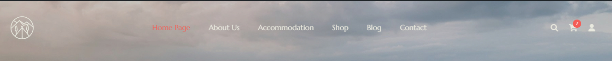
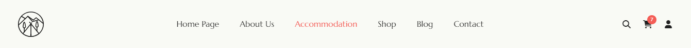
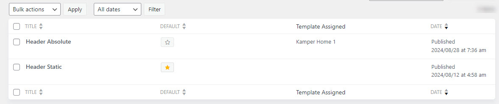
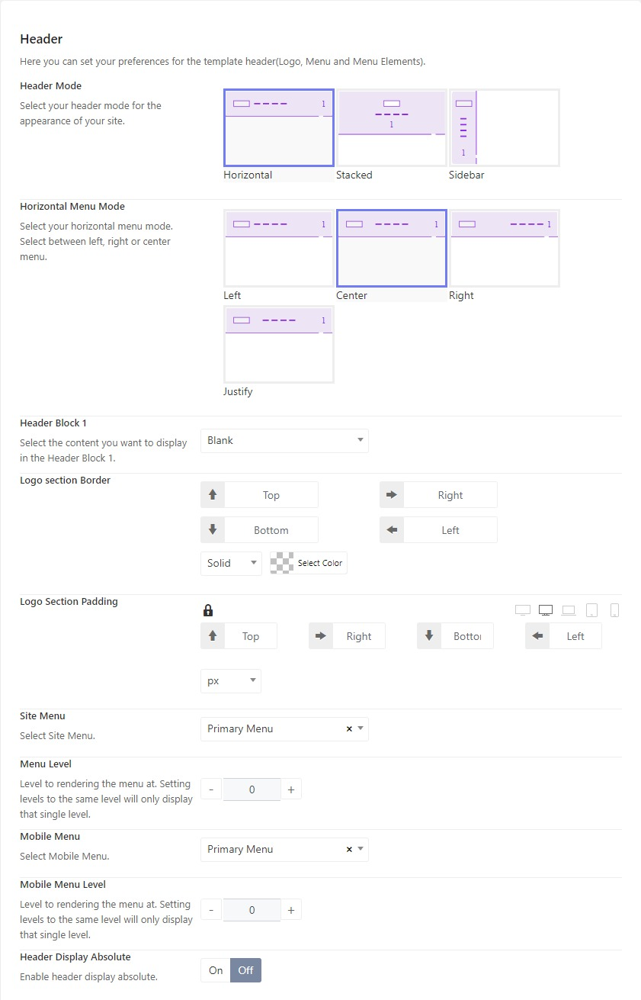
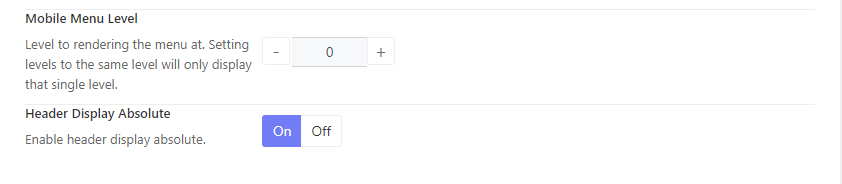
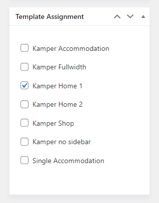
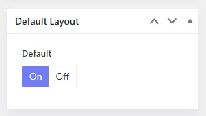
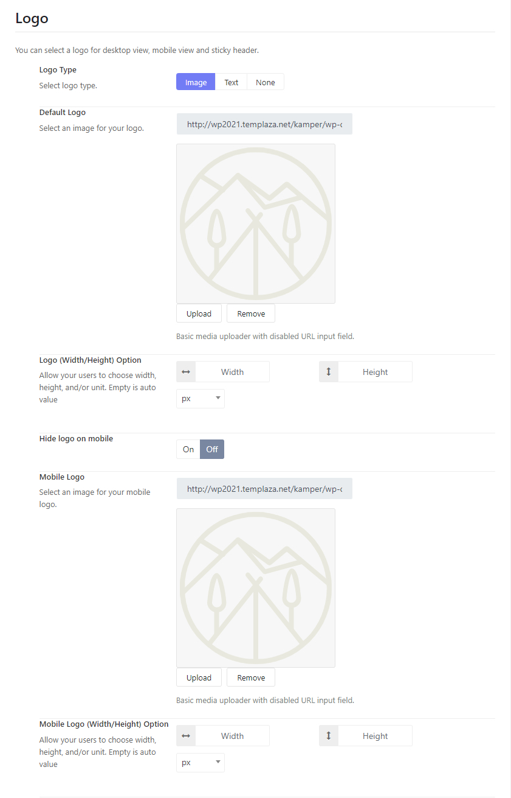
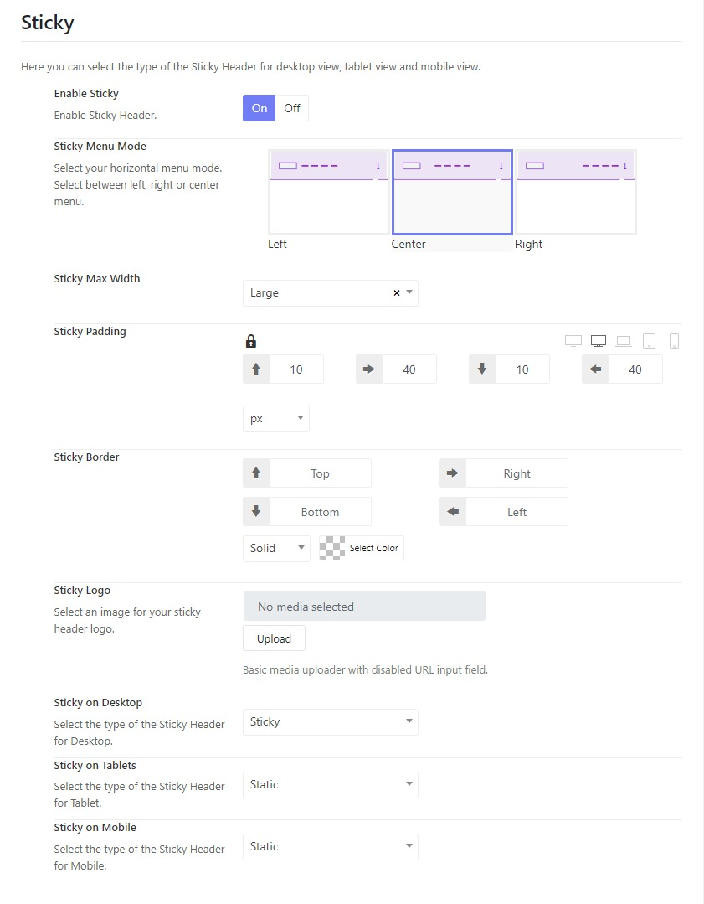

# Kamper Header

import Tabs from '@theme/Tabs';
import TabItem from '@theme/TabItem';

<Tabs className="unique-tabs">
  <TabItem value="Header">

The home page 1 and inner pages are assigned to Header Absolute (Transparent header), while the home 2 and home 3, and Inner Pages are assigned to the Header Static.

You can go to **Kamper Options > Headers >** There you can see 2 prebuilt header templates > Open each header template, you will see options to configure the header logo, header layout and others.

## Header modes

There are many header modes for you to choose from, including Horizontal, Stacked, and Sidebar.

## Transparent Header

You can see the Home page 1 coming with a transparent header, and you can make the header transparent by enabling the "Header Display Absolute".

## Header Block 1

Block 1 is a position where you can place a widget, contact info, and a custom html, It can be on the right of a horizontal menu, below the stacked menu, and at the bottom of the sidebar menu.

## Header Assignment

When editing each header, you can see the template Assignment which allows you to assign the header to specific templates you want.

In case you would like to apply the header to all the pages, just need to enable the default layout option.

</TabItem>
  <TabItem value="Default & Mobile Logo">
To change the theme's logo, please go to **Kamper Options > Headers > Open your header > Header >** Scroll down to the Logo section, choose logo type and change the logo.

You can adjust the logo's size by configuring the logo width and height options.

</TabItem>
  <TabItem value="Sticky Header">
Below the Logo section, you'll see the sticky options. Here you can enable or disable the sticky menu option.

* Sticky Menu Mode: there are 3 main sticky menu modes including Left, Center and Right.
* Sticky Max-width: you can choose an option for the sticky width.
* Sticky logo: Upload a logo for the sticky header.

</TabItem>

<TabItem value="Header Icons">
You can see some icons are displayed on the header, such as Search, Cart, and Login icons. 

Please go to **Kamper Options > Headers >** Open your header template > Header > Scroll down you'll see the Header Icons Section.
Here you can turn on or off icons. Change their icons among default, font awesome or custom, and configure the icon sizes.

</TabItem>
</Tabs>

  

