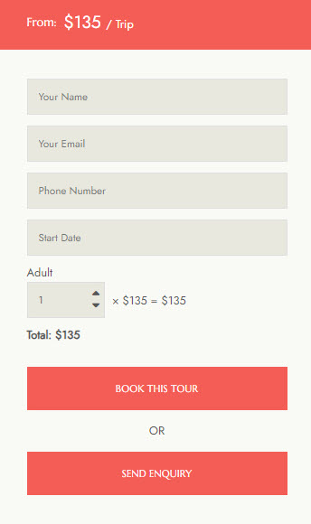
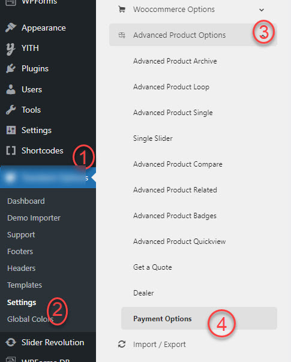
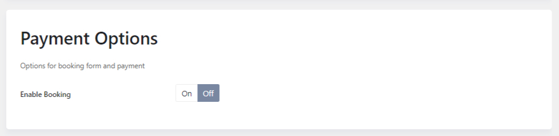
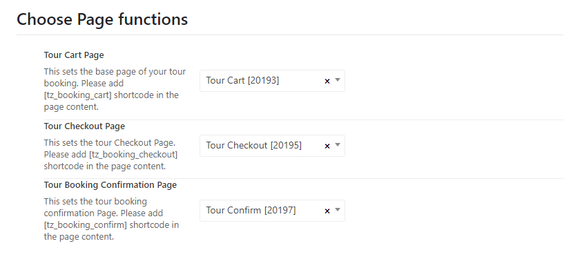
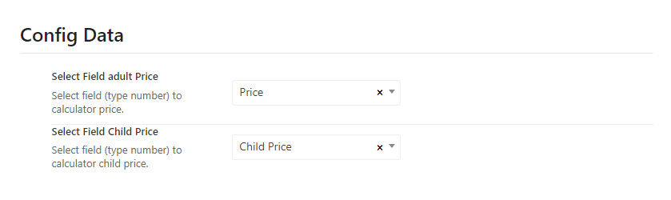
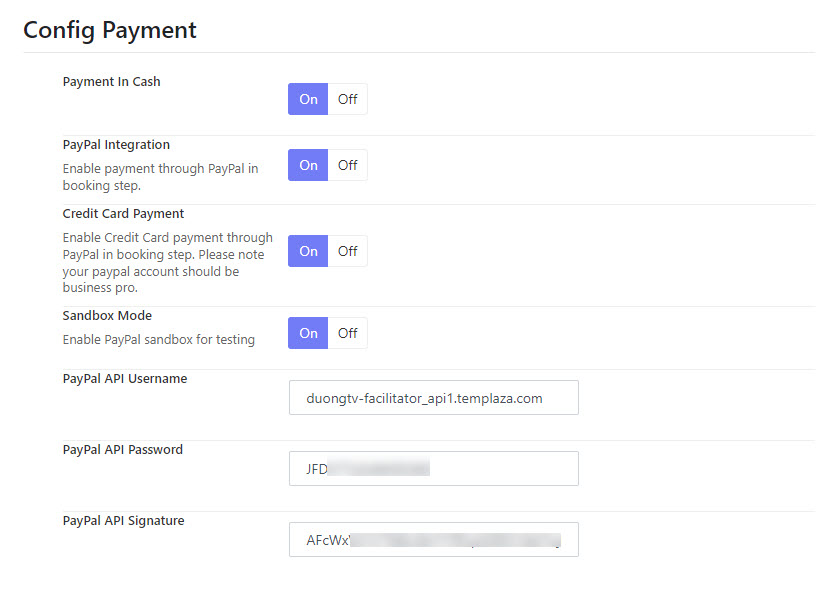
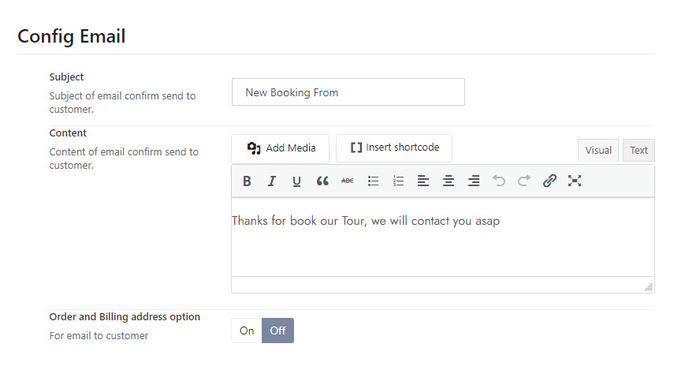
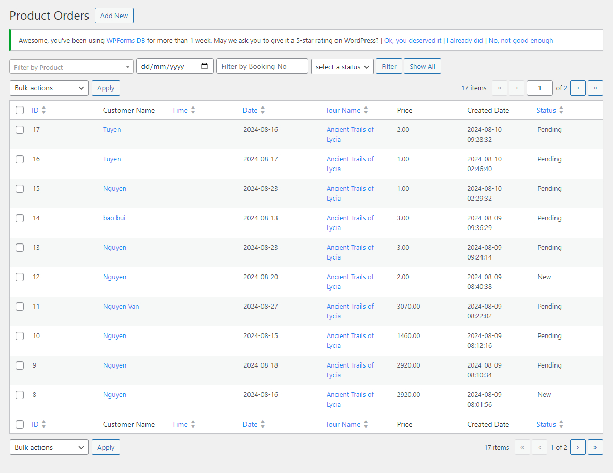
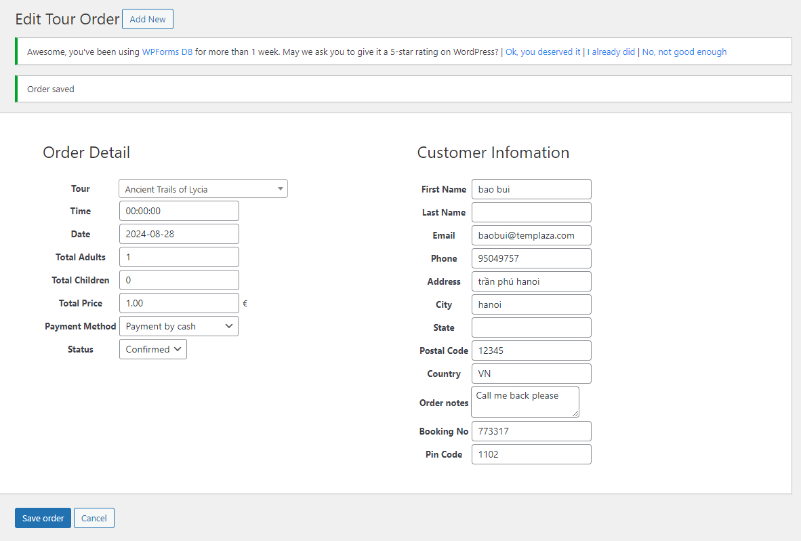

# Online Booking With Payment

## Enable Online Booking

Please go to **Kamper Options > Settings > Advanced Products Options > Payment >** Enable the booking. 

> The default inquiry form will still be displayed normally if this booking option is not enabled.

:::note

The payment option is only available on tours with specific prices. For tours with no price, sold, or contact type, the default booking form is displayed only.

:::

## Assign page functions

You can select a tour cart page, tour checkout, and booking confirmation page in this section. 

* Create a Tour cart page: Please go to Pages > Add New > Add the shortcode `[tz_booking_cart]` to the page content.
* Create a Tour Checkout Page: Please go to Pages > Add New > Add the shortcode `[tz_booking_checkout]` to the page content.
* Create a Tour Booking Confirmation Page: Please go to Pages > Add New > Add the shortcode `[tz_booking_confirm]` to the page content.

## Payment data configuration

Here you can choose a specific field for the adult price and child price. These fields should be a number type to calculate the price properly. 

## Payment configurations

Here are a bunch of options to configure the payment via Paypal. (At the moment, the booking function only supports the Paypal payment gateway.  We will add more payment methods in the future.)

## Email configuration

By default, customers will get an email when they submit for booking. This is to confirm that they booked a tour order successfully with the billing address. You can decide whether the billing address comes with the email or not. 

## Tour Order Tracking

Apparently, you would like to collect all the booking orders that are made on the website. When customers submit the booking form successfully, you can find the order in the Advanced Products > Orders. 

You can open each tour order and edit the info, to confirm the order. 

