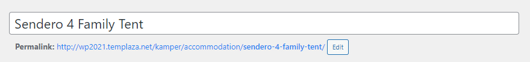
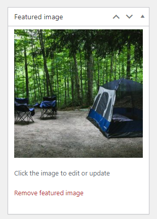
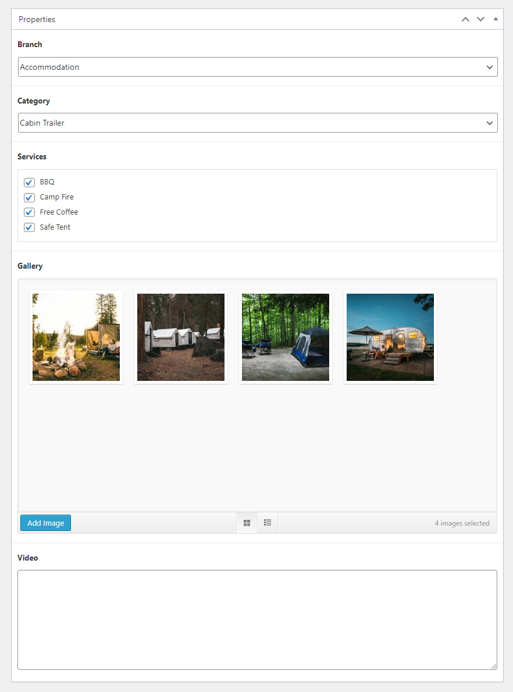
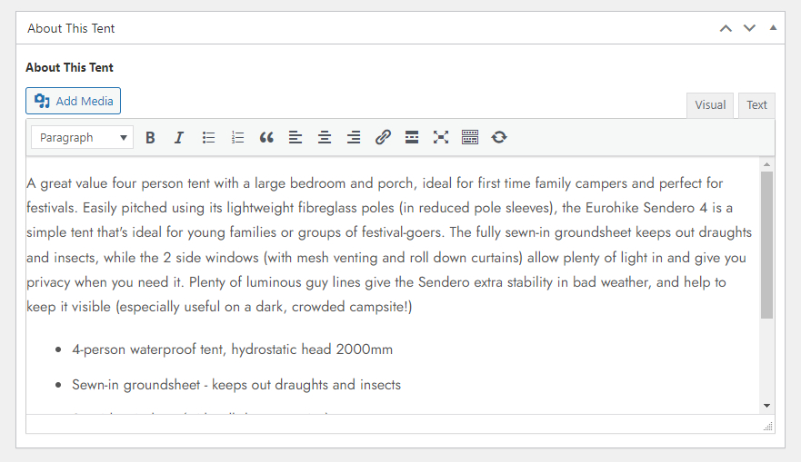
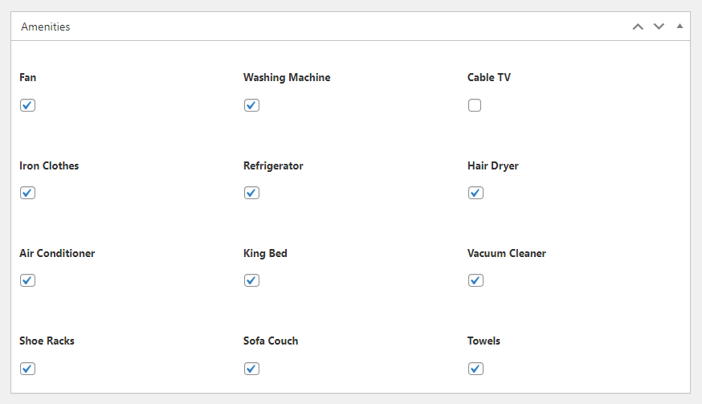

# Add A New Product

## How to create a new product

After adding branches, services, field groups, and custom fields, you're ready to add new accommodations. Go to Wp-admin > Advanced Products > Add new.

### Product Name

Enter a name for the new product.

### Product's Featured Image

On the right side, you can upload a featured image for the product.

### Product's Properties

In this section, you can choose a branch, category, select related services, and upload gallery images of the product. 

If you want to show a product video, you should enter the video URL or embeded code in the Video box. 

### Product Description (About This Tent)

This section is to present the product's description. You can enter the product's content an edit it directly here. 

### Amenities

Here you can show a list of necessary amenities that the camping site can provide. These amenities can range from basic necessities like fan, AC, refrigerator, TV and showers to more luxurious options like swimming pools and on-site restaurants.

> To create more options for amenities, please go to Advanced Products > Custom fields > Add New. And remember to assign the new field to Amenities Field Group. 

