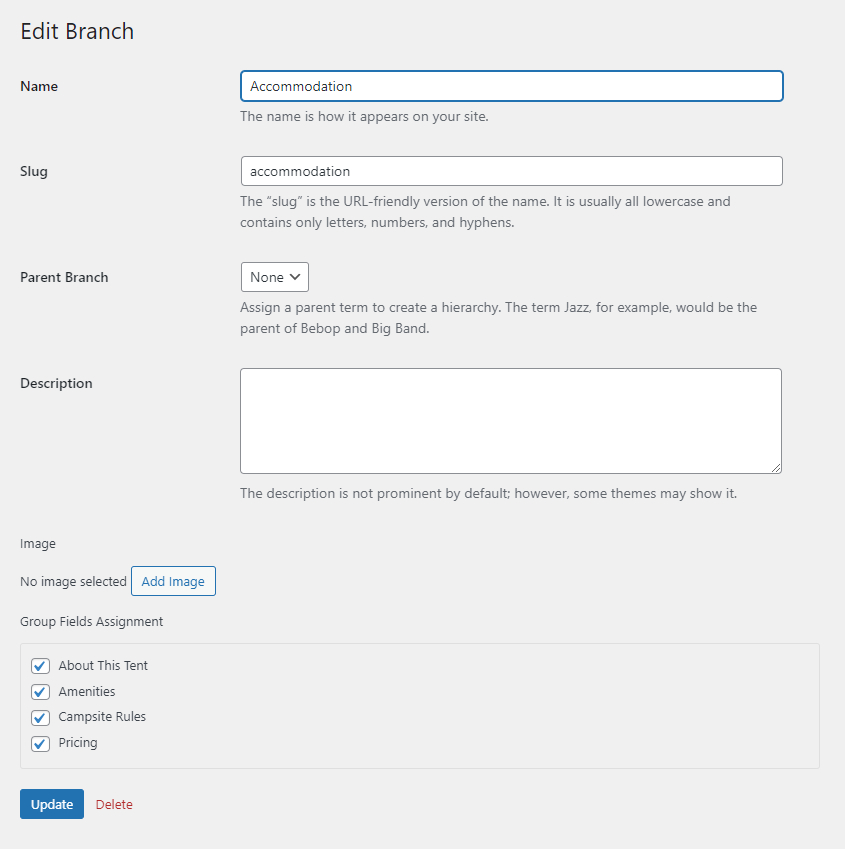

# Product Branch

Product Branch groups product items together that have the same custom fields. And you must create at least one branch to be assigned to products.

You can create different branches to specifically classify your available products. And each branch should be assigned to field groups.

Please go to **Advanced Products > Branches > Add New.**

