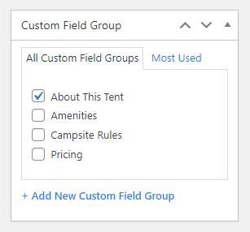
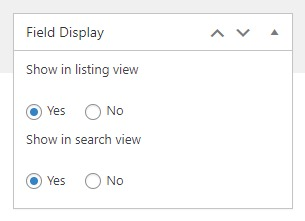

# About a custom field

* Field label: This is the name that will appear on the EDIT page.
* Field name: The field name should be a single word, with no spaces. Underscores and dashes are allowed.
* Field type: Choose a type of custom field from the drop-down list.
* Field instruction: Enter some notes about the field if you have.
* Required: Decide if the field is required or not.
* Icon: Choose an icon for the field.
* Icon image: Upload an icon image for the field.
* Choices: Input all the choices of the field, and enter each choice on a new line.
For more control, you may specify both a value and label like this:
red : Red
blue : Blue
* Default value: Enter each default value on a new line.
* Layout: Choose a layout to show the field.
* Search field type: Choose a field type for the search function.
* Search choices: Input choices of the field for the search function.
* Search default choice: Input a default choice of the field for the search function.
The Service menu was created under Custom Categories. You should open Custom categories > edit the Service there.

## Custom Field Group Assignment

A custom field should be assigned to one or more custom field groups, so they can be displayed properly in the front-end. 

## Field Display

On the right sidebar, you can see Field Display options. 

* Show in the listing view: Display the field on the listing page.
* Show in search view: Display the field in the search view. 

## Important notes

There are 2 types of custom fields you can see: protected and unprotected fields. Besides prebuilt fields, you can create many other fields according to your needs. 

:::warning

* Protected fields have a lock icon, and you shouldn't try to modify their field names and field types (in code files), you can just edit their field labels and adjust other options.
* You can delete unprotected fields, but protected fields shouldn't be deleted.

:::
