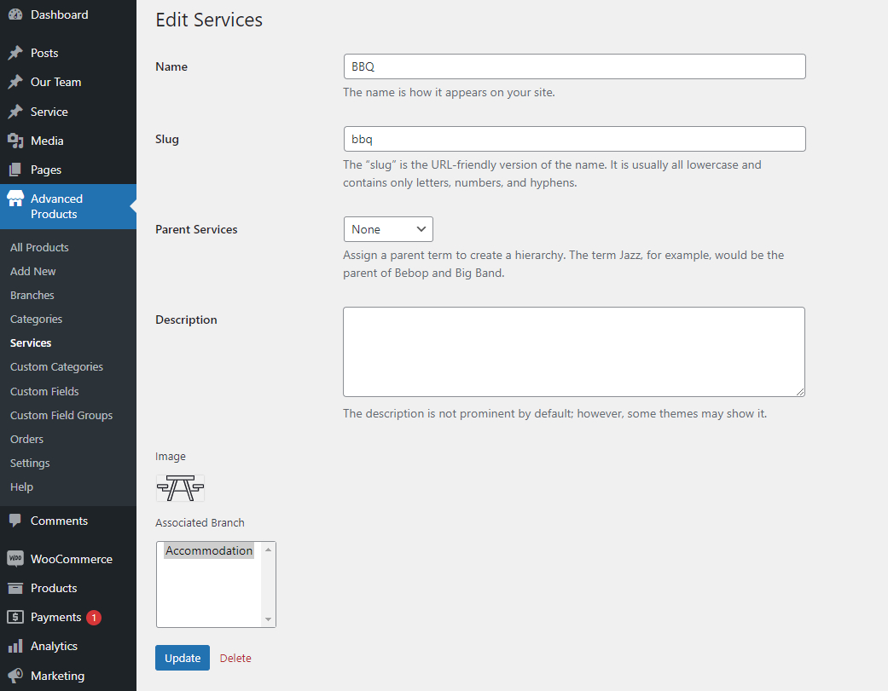

# Product Service

## Create a new service item

Please go to WP-admin > Advanced Products > Service > Add new

Enter the service's name, upload a service image, and assign the service to a branch.

### Translate Service

The Service menu was created under Custom Categories. You should open Custom categories > edit the Service there. 

