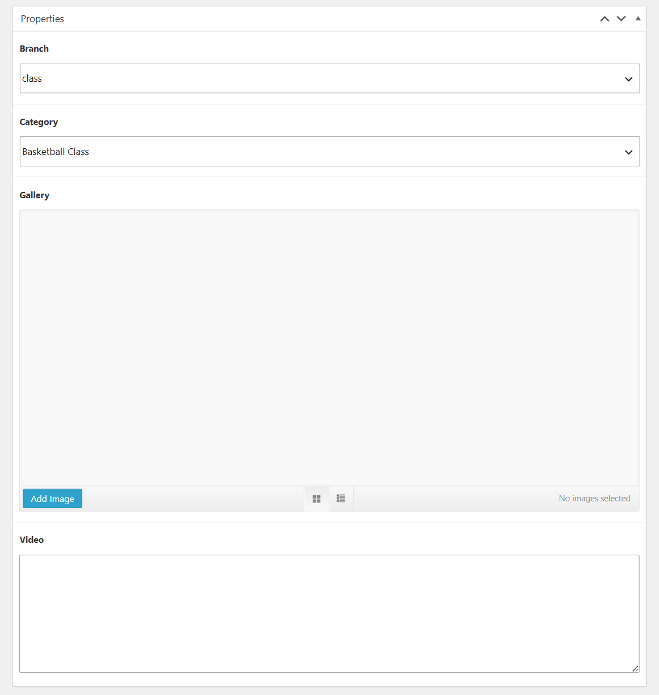
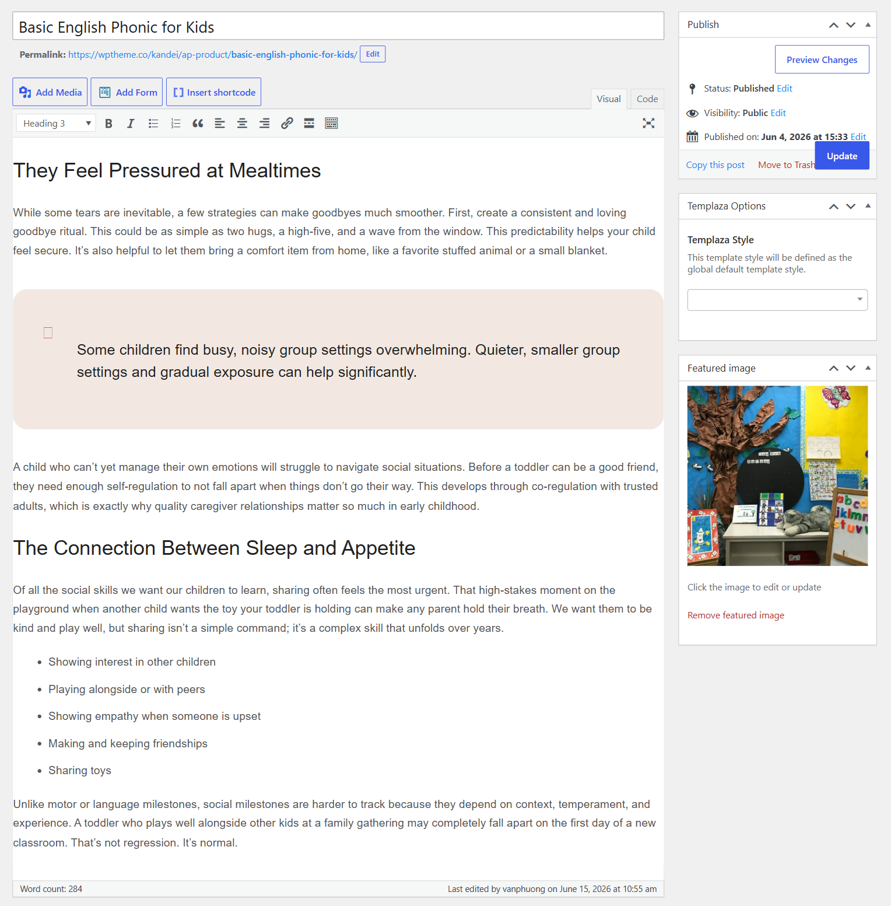
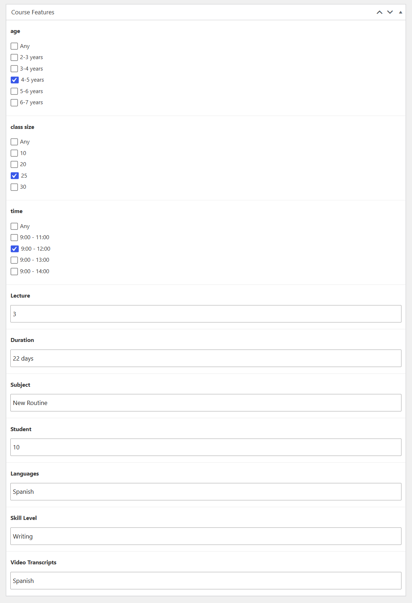
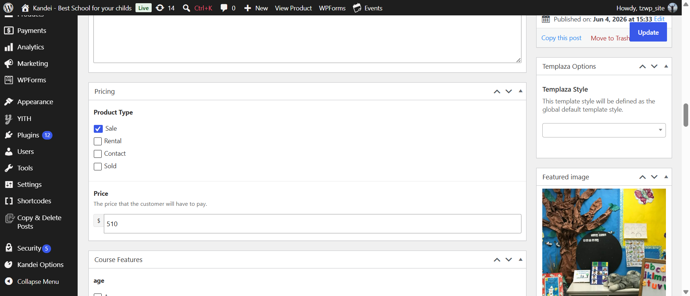
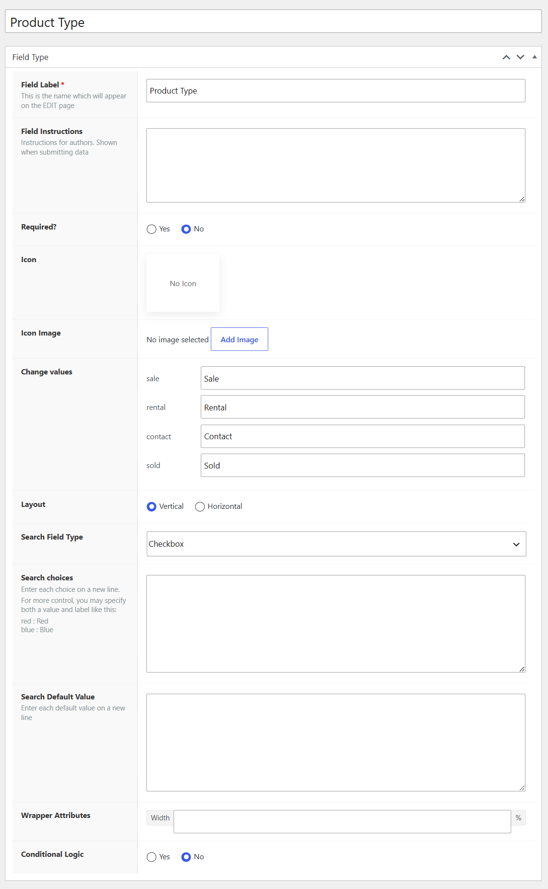

# How to add a new class

## How To Create A New Class

After adding branches, categories, field groups, and custom fields, you're ready to add new classes. Please go to Wp-admin > Advanced Products > Add new.

## Class Properties

You can choose a branch, and a category for a new class.

## Class Content

Add your class's content.

## Class Features

Here you can fulfill data for each field in the class features group. To edit one of these feature fields, you can go to Advanced Products > Custom Fields > Navigate and edit each one.

## Class Pricing

Set a price for your course. There are 4 main pricing types you can choose: 

* Sale
* Rental
* Contact 
* Sold 

To edit these pricing types, you can go to Advanced Products > Custom Fields > Navigate and edit Product Type field.
In case you would like to add more product types, please contact the support team. 

