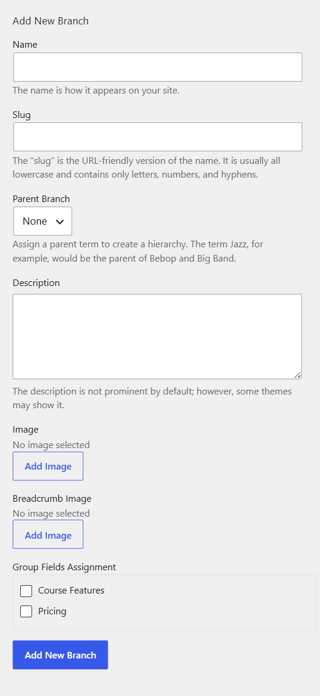

# Class Branch

A class branch is created to group classes together that share the same groups of custom fields. And It's a must to have at least one branch available to be assigned to products.

You can create different branches to specifically classify your available products. Each branch should be assigned to related field groups.

Please go to WP-admin > Advanced Products > Branch > Click add new Branch or edit a prebuilt branch. 

