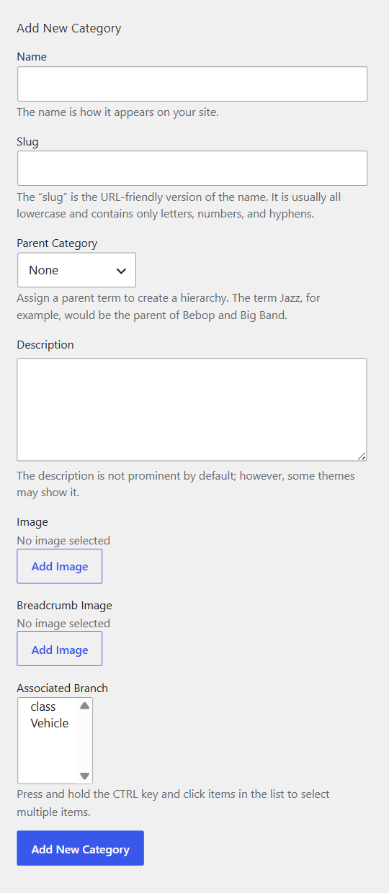

# Court Category

You can create different categories to represent different types of sports like Painting, Yoga, Football, Dancing and so on. 

Court category is linked to the Category field in the custom fields. The category is a protected field, so you can edit the field label, and others except for its field name and field type.
Go to WP-admin > Advanced Products > Category > Add new. You should assign each category to a branch.

