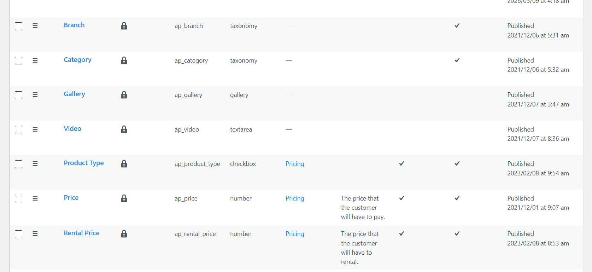
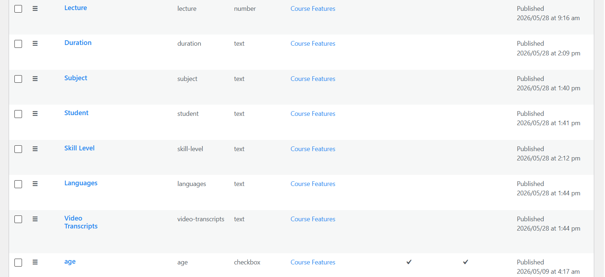
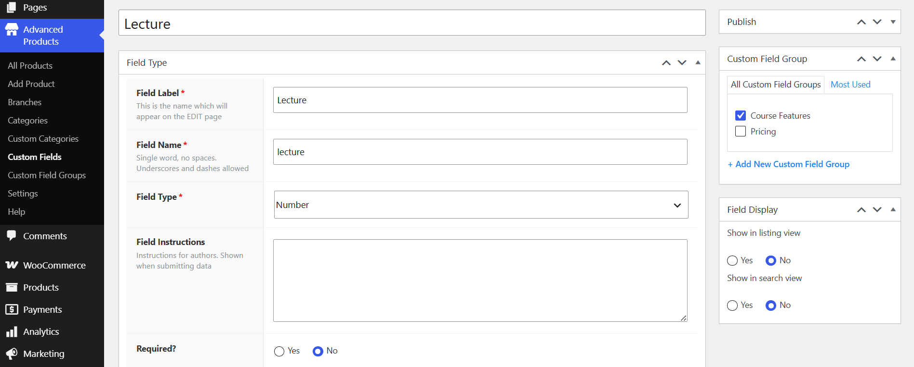

# Custom Fields

Custom Fields allow you to add additional product information beyond the standard product fields. They are useful for displaying extra specifications, attributes, or custom data for individual products.

## Protected Fields

Fields with a lock icon are predefined system fields that are protected by Advanced Products. These fields are required for the functionality of the product system and should not be modified, deleted, or changed in ways that could affect how Advanced Products works.

## Unprotected Fields 

Fields without a lock icon are custom or unprotected fields. These fields can be freely managed according to your website's requirements. You can typically add new ones, edit, customize, or remove them without affecting the core functionality of Advanced Products.

## Custom field Assignment

When creating or editing a custom field, you can assign it to one or more Custom Field Groups. In the Custom Field Group section, select the group where you want the field to appear.

For example, the Lecture field is assigned to the Course Features group. This allows the field to be organized together with other course-related fields and displayed as part of that group when editing a product.

## Field Display

The Field Display settings control where the custom field's value is displayed on the frontend:

* Show in listing view – Choose Yes to display the field value in product listing pages.
* Show in search view – Choose Yes to include the field value in search results.

Select No if the field is still available when editing products but it's not displayed in those views.

This gives you flexibility to organize custom fields into groups and control where their values appear on the frontend.

