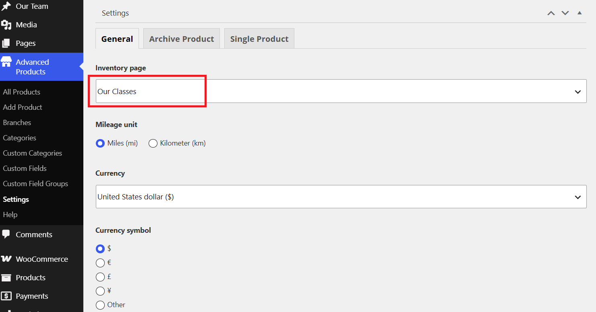
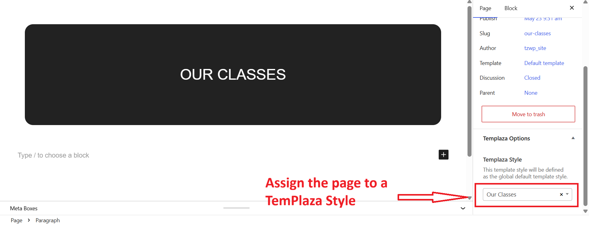
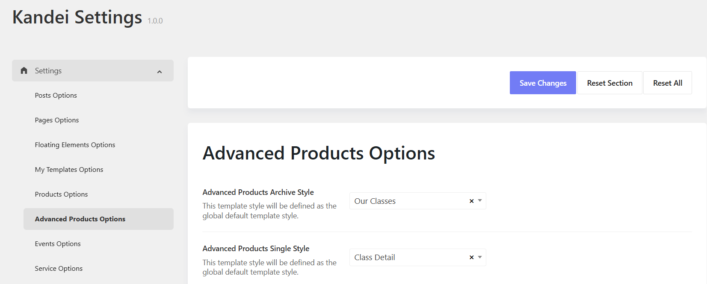

# Choose a class page

To showcase your class page, you should go to Advanced Products > Settings > General tab > Choose the page "Our Classes" from the list. 
>> If you haven't had a class page in the list, please go to Pages > Add a new one. 

# Assign a template to class page

**Our Class** page should be assigned to the TemPlaza Style: **Our Classes**. 
You can go to Pages > Navigate and edit Our Classes page > then on the right sidebar, you can see TemPlaza Style option > Choose the template. 

# Assign templates to archived class pages and single class pages

To assign a template style for single class page, you should go to Kandei Options > Settings > Settings > Advanced Products Options.

* Advanced Products Archived Style: > Our Classes
* Advanced products Single Style: > Class Detail

# Advanced Products Options*

Please go to Kandei Options > Settings > Advanced Products Options
Here you will find options to configure for:
* Advanced products Archive: Settings for archived pages
* Advanced Products Loop: Settings for product loop 
* Advanced products Single: Settings for single classes
* Single Slider: Settings for slider in gallery format type 
* Advanced Products Related: Settings for related classes

