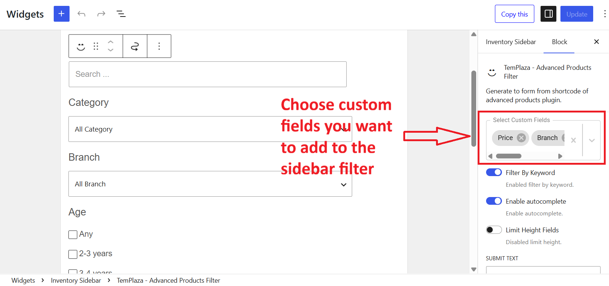
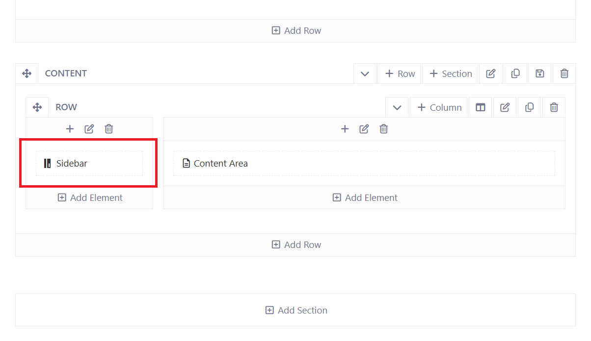
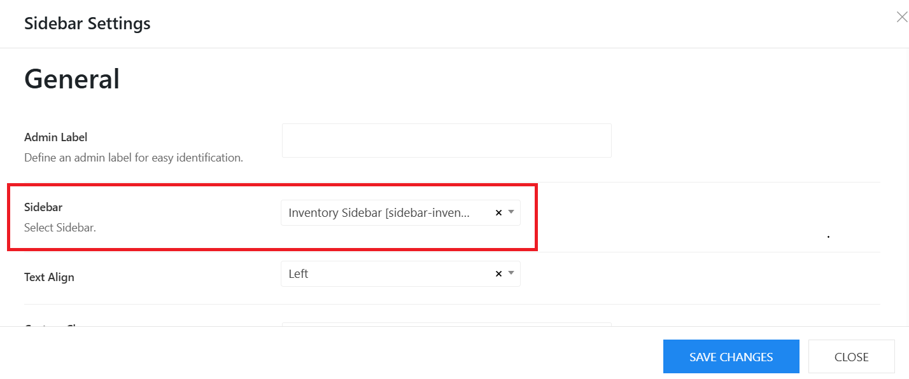

# Sidebar Filter

## Options

The sidebar filter on **Our Classes** page includes different custom fields from Advanced products plugin. 

* Please go to Appearance > Widgets > Toggle the Inventory Sidebar
* Click on "+" icon to add a new element > search and choose **TemPlaza - Advanced Products Filter**.
* After adding the TemPlaza - Advanced Product Filter, the options appear on the right sidebar. 

* Select Custom Fields: Here you can select custom fields that you want to display on the filter.
* Key Word: Enable this option to display the search by keyword.
* Limit height field: Enable this option to limit the filter height in case you set up a horizontal filter.
* Submit text: Edit the Search Court text.
* Use Ajax Filtering: no filter button needed.
* Update URL: Enable this option when you want to update the url after selecting filter attributes.

## General Settings

1. Max height: Set the max height of the sidebar filter
2. Large Desktop Columns: Set the number of products per row on large desktops (1600px and larger)
3. Desktop Columns: Set the number of products per row (1200px and larger)
4. Laptop Columns: Set the number of products per row (960px and larger)
5. Tablet Columns: Set the number of products per row (640px and larger)
6. Mobile Columns: Set the number of products per row on mobile phones

## Assign the widget to a template

The inventory Sidebar is created for Our Classes page. So to help this sidebar to display properly on the page, we need to add it to a corresponding template "Our Classes". 
Please go to Kandei Options > Templates > Edit "Our Classes" template > Layout > edit the sidebar column > choose a sidebar widget. 

